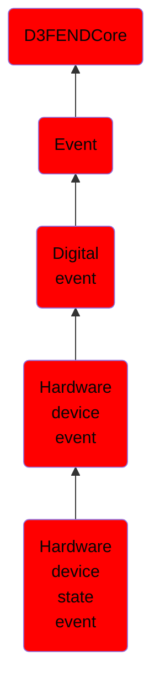

# Hardware device state event

## Overview

### Definition
An event involving a change to a device's state, such as connection, disconnection, modification, or operational state transitions (e.g., online or offline). Device state events provide visibility into device availability and operational conditions.

### Examples
Not defined.

### Aliases
Not defined.

### URI
http://d3fend.mitre.org/ontologies/d3fend.owl#HardwareDeviceStateEvent

### Subclass Of

- [D3FENDCore](/docs/ontology/reference/model/D3FENDCore/D3FENDCore.md)
- [Event](/docs/ontology/reference/model/D3FENDCore/Event/Event.md)
- [Digital event](/docs/ontology/reference/model/D3FENDCore/Event/Digital%20event/Digital%20event.md)
- [Hardware device event](/docs/ontology/reference/model/D3FENDCore/Event/Digital%20event/Hardware%20device%20event/Hardware%20device%20event.md)
- [Hardware device state event](/docs/ontology/reference/model/D3FENDCore/Event/Digital%20event/Hardware%20device%20event/Hardware%20device%20state%20event/Hardware%20device%20state%20event.md)

### Ontology Reference
- [d3fend](http://d3fend.mitre.org/ontologies/d3fend.owl#)

## Properties
