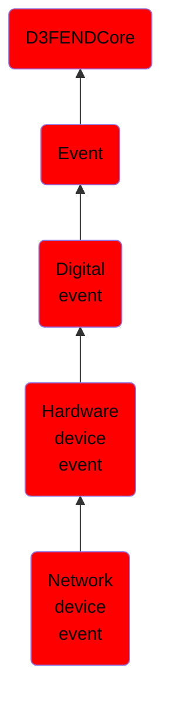

# Network device event

## Overview

### Definition
An event capturing the activity or state of network devices, such as Ethernet adapters, Wi-Fi modules, or virtual interfaces. These events highlight connectivity, configuration, or performance changes.

### Examples
Not defined.

### Aliases
Not defined.

### URI
http://d3fend.mitre.org/ontologies/d3fend.owl#NetworkDeviceEvent

### Subclass Of

- [D3FENDCore](/docs/ontology/reference/model/D3FENDCore/D3FENDCore.md)
- [Event](/docs/ontology/reference/model/D3FENDCore/Event/Event.md)
- [Digital event](/docs/ontology/reference/model/D3FENDCore/Event/Digital%20event/Digital%20event.md)
- [Hardware device event](/docs/ontology/reference/model/D3FENDCore/Event/Digital%20event/Hardware%20device%20event/Hardware%20device%20event.md)
- [Network device event](/docs/ontology/reference/model/D3FENDCore/Event/Digital%20event/Hardware%20device%20event/Network%20device%20event/Network%20device%20event.md)

### Ontology Reference
- [d3fend](http://d3fend.mitre.org/ontologies/d3fend.owl#)

## Properties
