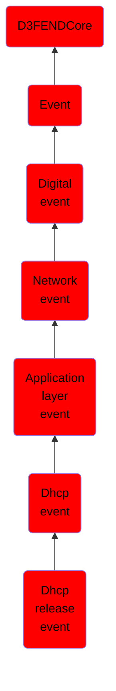

# Dhcp release event

## Overview

### Definition
An event where a DHCP client sends a RELEASE message to relinquish its assigned IP address and cancel any remaining lease duration.

### Examples
Not defined.

### Aliases
DHCPRELEASE

### URI
http://d3fend.mitre.org/ontologies/d3fend.owl#DHCPReleaseEvent

### Subclass Of

- [D3FENDCore](/docs/ontology/reference/model/D3FENDCore/D3FENDCore.md)
- [Event](/docs/ontology/reference/model/D3FENDCore/Event/Event.md)
- [Digital event](/docs/ontology/reference/model/D3FENDCore/Event/Digital%20event/Digital%20event.md)
- [Network event](/docs/ontology/reference/model/D3FENDCore/Event/Digital%20event/Network%20event/Network%20event.md)
- [Application layer event](/docs/ontology/reference/model/D3FENDCore/Event/Digital%20event/Network%20event/Application%20layer%20event/Application%20layer%20event.md)
- [Dhcp event](/docs/ontology/reference/model/D3FENDCore/Event/Digital%20event/Network%20event/Application%20layer%20event/Dhcp%20event/Dhcp%20event.md)
- [Dhcp release event](/docs/ontology/reference/model/D3FENDCore/Event/Digital%20event/Network%20event/Application%20layer%20event/Dhcp%20event/Dhcp%20release%20event/Dhcp%20release%20event.md)

### Ontology Reference
- [d3fend](http://d3fend.mitre.org/ontologies/d3fend.owl#)

## Properties
