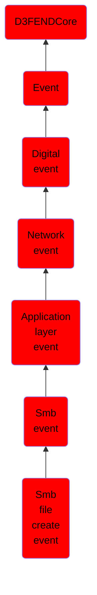

# Smb file create event

## Overview

### Definition
An event where a file is created if it does not already exist, failing if the file is already present. This operation strictly enforces new file creation.

### Examples
Not defined.

### Aliases
Not defined.

### URI
http://d3fend.mitre.org/ontologies/d3fend.owl#SMBFileCreateEvent

### Subclass Of

- [D3FENDCore](/docs/ontology/reference/model/D3FENDCore/D3FENDCore.md)
- [Event](/docs/ontology/reference/model/D3FENDCore/Event/Event.md)
- [Digital event](/docs/ontology/reference/model/D3FENDCore/Event/Digital%20event/Digital%20event.md)
- [Network event](/docs/ontology/reference/model/D3FENDCore/Event/Digital%20event/Network%20event/Network%20event.md)
- [Application layer event](/docs/ontology/reference/model/D3FENDCore/Event/Digital%20event/Network%20event/Application%20layer%20event/Application%20layer%20event.md)
- [Smb event](/docs/ontology/reference/model/D3FENDCore/Event/Digital%20event/Network%20event/Application%20layer%20event/Smb%20event/Smb%20event.md)
- [Smb file create event](/docs/ontology/reference/model/D3FENDCore/Event/Digital%20event/Network%20event/Application%20layer%20event/Smb%20event/Smb%20file%20create%20event/Smb%20file%20create%20event.md)

### Ontology Reference
- [d3fend](http://d3fend.mitre.org/ontologies/d3fend.owl#)

## Properties
