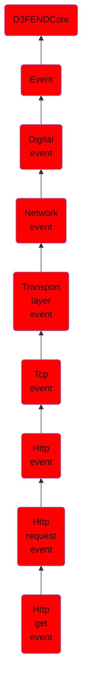

# Http get event

## Overview

### Definition
An event where the HTTP GET method is used to request a representation of the specified resource.

### Examples
Not defined.

### Aliases
Not defined.

### URI
http://d3fend.mitre.org/ontologies/d3fend.owl#HTTPGetEvent

### Subclass Of

- [D3FENDCore](/docs/ontology/reference/model/D3FENDCore/D3FENDCore.md)
- [Event](/docs/ontology/reference/model/D3FENDCore/Event/Event.md)
- [Digital event](/docs/ontology/reference/model/D3FENDCore/Event/Digital%20event/Digital%20event.md)
- [Network event](/docs/ontology/reference/model/D3FENDCore/Event/Digital%20event/Network%20event/Network%20event.md)
- [Transport layer event](/docs/ontology/reference/model/D3FENDCore/Event/Digital%20event/Network%20event/Transport%20layer%20event/Transport%20layer%20event.md)
- [Tcp event](/docs/ontology/reference/model/D3FENDCore/Event/Digital%20event/Network%20event/Transport%20layer%20event/Tcp%20event/Tcp%20event.md)
- [Http event](/docs/ontology/reference/model/D3FENDCore/Event/Digital%20event/Network%20event/Transport%20layer%20event/Tcp%20event/Http%20event/Http%20event.md)
- [Http request event](/docs/ontology/reference/model/D3FENDCore/Event/Digital%20event/Network%20event/Transport%20layer%20event/Tcp%20event/Http%20event/Http%20request%20event/Http%20request%20event.md)
- [Http get event](/docs/ontology/reference/model/D3FENDCore/Event/Digital%20event/Network%20event/Transport%20layer%20event/Tcp%20event/Http%20event/Http%20request%20event/Http%20get%20event/Http%20get%20event.md)

### Ontology Reference
- [d3fend](http://d3fend.mitre.org/ontologies/d3fend.owl#)

## Properties
