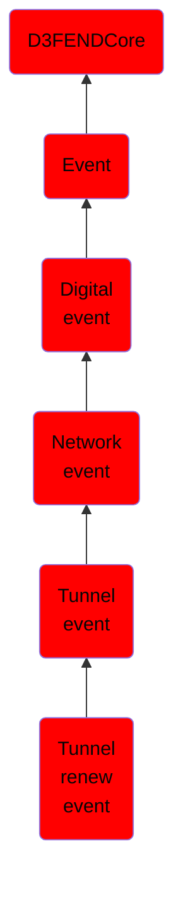

# Tunnel renew event

## Overview

### Definition
An event where the lifecycle of a network tunnel is extended, ensuring continued encapsulated communication and avoiding session expiration.

### Examples
Not defined.

### Aliases
Not defined.

### URI
http://d3fend.mitre.org/ontologies/d3fend.owl#TunnelRenewEvent

### Subclass Of

- [D3FENDCore](/docs/ontology/reference/model/D3FENDCore/D3FENDCore.md)
- [Event](/docs/ontology/reference/model/D3FENDCore/Event/Event.md)
- [Digital event](/docs/ontology/reference/model/D3FENDCore/Event/Digital%20event/Digital%20event.md)
- [Network event](/docs/ontology/reference/model/D3FENDCore/Event/Digital%20event/Network%20event/Network%20event.md)
- [Tunnel event](/docs/ontology/reference/model/D3FENDCore/Event/Digital%20event/Network%20event/Tunnel%20event/Tunnel%20event.md)
- [Tunnel renew event](/docs/ontology/reference/model/D3FENDCore/Event/Digital%20event/Network%20event/Tunnel%20event/Tunnel%20renew%20event/Tunnel%20renew%20event.md)

### Ontology Reference
- [d3fend](http://d3fend.mitre.org/ontologies/d3fend.owl#)

## Properties
