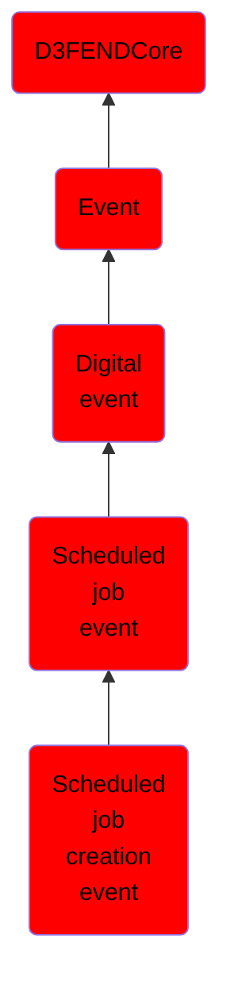

# Scheduled job creation event

## Overview

### Definition
An event representing the addition of a new task to the system's scheduler, defining its execution criteria and associated actions.

### Examples
Not defined.

### Aliases
Not defined.

### URI
http://d3fend.mitre.org/ontologies/d3fend.owl#ScheduledJobCreationEvent

### Subclass Of

- [D3FENDCore](/docs/ontology/reference/model/D3FENDCore/D3FENDCore.md)
- [Event](/docs/ontology/reference/model/D3FENDCore/Event/Event.md)
- [Digital event](/docs/ontology/reference/model/D3FENDCore/Event/Digital%20event/Digital%20event.md)
- [Scheduled job event](/docs/ontology/reference/model/D3FENDCore/Event/Digital%20event/Scheduled%20job%20event/Scheduled%20job%20event.md)
- [Scheduled job creation event](/docs/ontology/reference/model/D3FENDCore/Event/Digital%20event/Scheduled%20job%20event/Scheduled%20job%20creation%20event/Scheduled%20job%20creation%20event.md)

### Ontology Reference
- [d3fend](http://d3fend.mitre.org/ontologies/d3fend.owl#)

## Properties
