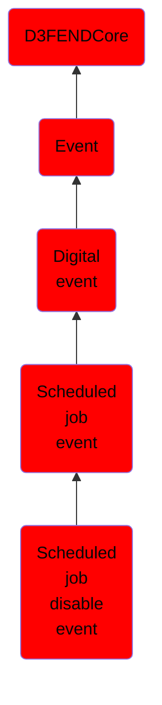

# Scheduled job disable event

## Overview

### Definition
An event where a scheduled task is deactivated, preventing further execution until re-enabled.

### Examples
Not defined.

### Aliases
Not defined.

### URI
http://d3fend.mitre.org/ontologies/d3fend.owl#ScheduledJobDisableEvent

### Subclass Of

- [D3FENDCore](/docs/ontology/reference/model/D3FENDCore/D3FENDCore.md)
- [Event](/docs/ontology/reference/model/D3FENDCore/Event/Event.md)
- [Digital event](/docs/ontology/reference/model/D3FENDCore/Event/Digital%20event/Digital%20event.md)
- [Scheduled job event](/docs/ontology/reference/model/D3FENDCore/Event/Digital%20event/Scheduled%20job%20event/Scheduled%20job%20event.md)
- [Scheduled job disable event](/docs/ontology/reference/model/D3FENDCore/Event/Digital%20event/Scheduled%20job%20event/Scheduled%20job%20disable%20event/Scheduled%20job%20disable%20event.md)

### Ontology Reference
- [d3fend](http://d3fend.mitre.org/ontologies/d3fend.owl#)

## Properties
