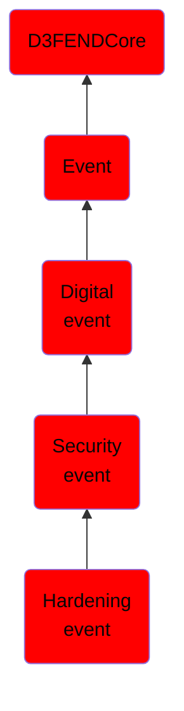

# Hardening event

## Overview

### Definition
An event involving actions to strengthen defenses, such as applying patches or implementing secure configurations, reducing attack surfaces, and increasing the difficulty of exploitation by adversaries.

### Examples
Not defined.

### Aliases
Not defined.

### URI
http://d3fend.mitre.org/ontologies/d3fend.owl#HardeningEvent

### Subclass Of

- [D3FENDCore](/docs/ontology/reference/model/D3FENDCore/D3FENDCore.md)
- [Event](/docs/ontology/reference/model/D3FENDCore/Event/Event.md)
- [Digital event](/docs/ontology/reference/model/D3FENDCore/Event/Digital%20event/Digital%20event.md)
- [Security event](/docs/ontology/reference/model/D3FENDCore/Event/Digital%20event/Security%20event/Security%20event.md)
- [Hardening event](/docs/ontology/reference/model/D3FENDCore/Event/Digital%20event/Security%20event/Hardening%20event/Hardening%20event.md)

### Ontology Reference
- [d3fend](http://d3fend.mitre.org/ontologies/d3fend.owl#)

## Properties
