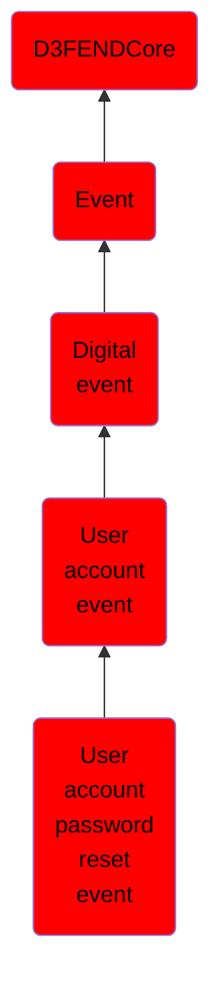

# User account password reset event

## Overview

### Definition
An event where a user account's password is reset, typically due to a forgotten password or administrative action.

### Examples
Not defined.

### Aliases
Not defined.

### URI
http://d3fend.mitre.org/ontologies/d3fend.owl#UserAccountPasswordResetEvent

### Subclass Of

- [D3FENDCore](/docs/ontology/reference/model/D3FENDCore/D3FENDCore.md)
- [Event](/docs/ontology/reference/model/D3FENDCore/Event/Event.md)
- [Digital event](/docs/ontology/reference/model/D3FENDCore/Event/Digital%20event/Digital%20event.md)
- [User account event](/docs/ontology/reference/model/D3FENDCore/Event/Digital%20event/User%20account%20event/User%20account%20event.md)
- [User account password reset event](/docs/ontology/reference/model/D3FENDCore/Event/Digital%20event/User%20account%20event/User%20account%20password%20reset%20event/User%20account%20password%20reset%20event.md)

### Ontology Reference
- [d3fend](http://d3fend.mitre.org/ontologies/d3fend.owl#)

## Properties
