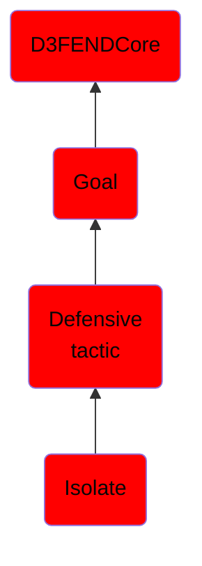

# Isolate

## Overview

### Definition
The isolate tactic creates logical or physical barriers in a system which reduces opportunities for adversaries to create further accesses.

### Examples
Not defined.

### Aliases
Not defined.

### URI
http://d3fend.mitre.org/ontologies/d3fend.owl#Isolate

### Subclass Of

- [D3FENDCore](/docs/ontology/reference/model/D3FENDCore/D3FENDCore.md)
- [Goal](/docs/ontology/reference/model/D3FENDCore/Goal/Goal.md)
- [Defensive tactic](/docs/ontology/reference/model/D3FENDCore/Goal/Defensive%20tactic/Defensive%20tactic.md)
- [Isolate](/docs/ontology/reference/model/D3FENDCore/Goal/Defensive%20tactic/Isolate/Isolate.md)

### Ontology Reference
- [d3fend](http://d3fend.mitre.org/ontologies/d3fend.owl#)

## Properties
