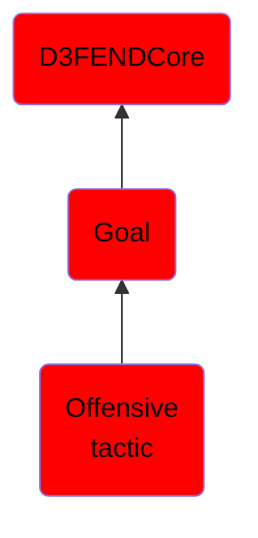

# Offensive tactic

## Overview

### Definition
Per ATT&CK, these are defined as Tactical Goals, not Tactics per se. Many children also fit definition of tactics.  Some are neither tactics or tactical goals really (e.g., Execution, which is a useful grouping, but an action, not really a tactic or technique.

### Examples
Not defined.

### Aliases
Not defined.

### URI
http://d3fend.mitre.org/ontologies/d3fend.owl#OffensiveTactic

### Subclass Of

- [D3FENDCore](/docs/ontology/reference/model/D3FENDCore/D3FENDCore.md)
- [Goal](/docs/ontology/reference/model/D3FENDCore/Goal/Goal.md)
- [Offensive tactic](/docs/ontology/reference/model/D3FENDCore/Goal/Offensive%20tactic/Offensive%20tactic.md)

### Ontology Reference
- [d3fend](http://d3fend.mitre.org/ontologies/d3fend.owl#)

## Properties
