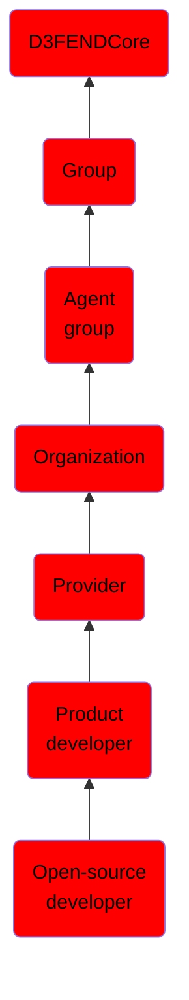

# Open-source developer

## Overview

### Definition
Not defined.

### Examples
Not defined.

### Aliases
Not defined.

### URI
http://d3fend.mitre.org/ontologies/d3fend.owl#Open-sourceDeveloper

### Subclass Of

- [D3FENDCore](/docs/ontology/reference/model/D3FENDCore/D3FENDCore.md)
- [Group](/docs/ontology/reference/model/D3FENDCore/Group/Group.md)
- [Agent group](/docs/ontology/reference/model/D3FENDCore/Group/Agent%20group/Agent%20group.md)
- [Organization](/docs/ontology/reference/model/D3FENDCore/Group/Agent%20group/Organization/Organization.md)
- [Provider](/docs/ontology/reference/model/D3FENDCore/Group/Agent%20group/Organization/Provider/Provider.md)
- [Product developer](/docs/ontology/reference/model/D3FENDCore/Group/Agent%20group/Organization/Provider/Product%20developer/Product%20developer.md)
- [Open-source developer](/docs/ontology/reference/model/D3FENDCore/Group/Agent%20group/Organization/Provider/Product%20developer/Open-source%20developer/Open-source%20developer.md)

### Ontology Reference
- [d3fend](http://d3fend.mitre.org/ontologies/d3fend.owl#)

## Properties
