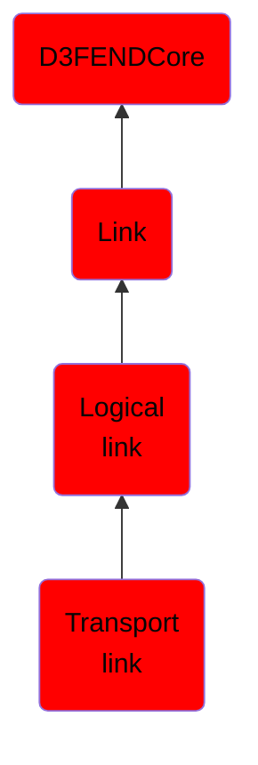

# Transport link

## Overview

### Definition
Not defined.

### Examples
Not defined.

### Aliases
Not defined.

### URI
http://d3fend.mitre.org/ontologies/d3fend.owl#TransportLink

### Subclass Of

- [D3FENDCore](/docs/ontology/reference/model/D3FENDCore/D3FENDCore.md)
- [Link](/docs/ontology/reference/model/D3FENDCore/Link/Link.md)
- [Logical link](/docs/ontology/reference/model/D3FENDCore/Link/Logical%20link/Logical%20link.md)
- [Transport link](/docs/ontology/reference/model/D3FENDCore/Link/Logical%20link/Transport%20link/Transport%20link.md)

### Ontology Reference
- [d3fend](http://d3fend.mitre.org/ontologies/d3fend.owl#)

## Properties
