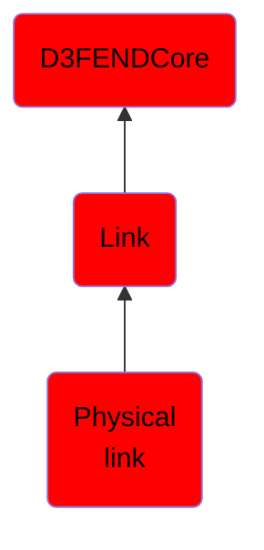

# Physical link

## Overview

### Definition
A physical link is a dedicated connection for communication that uses some physical media (electrical, electromagnetic, optical, to include clear spaces or vacuums.)  A physical link represents only a single hop (link) in any larger communcations path, circuit, or network.

NOTE: not synonymous with data link as a data link can be over a telecommunications circuit, which may be a virtual circuit composed of multiple phyical links.

### Examples
Not defined.

### Aliases
Not defined.

### URI
http://d3fend.mitre.org/ontologies/d3fend.owl#PhysicalLink

### Subclass Of

- [D3FENDCore](/docs/ontology/reference/model/D3FENDCore/D3FENDCore.md)
- [Link](/docs/ontology/reference/model/D3FENDCore/Link/Link.md)
- [Physical link](/docs/ontology/reference/model/D3FENDCore/Link/Physical%20link/Physical%20link.md)

### Ontology Reference
- [d3fend](http://d3fend.mitre.org/ontologies/d3fend.owl#)

## Properties
