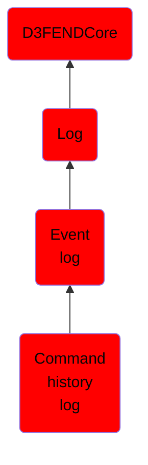

# Command history log

## Overview

### Definition
A log of commands run in an operating system shell.

### Examples
Not defined.

### Aliases
Not defined.

### URI
http://d3fend.mitre.org/ontologies/d3fend.owl#CommandHistoryLog

### Subclass Of

- [D3FENDCore](/docs/ontology/reference/model/D3FENDCore/D3FENDCore.md)
- [Log](/docs/ontology/reference/model/D3FENDCore/Log/Log.md)
- [Event log](/docs/ontology/reference/model/D3FENDCore/Log/Event%20log/Event%20log.md)
- [Command history log](/docs/ontology/reference/model/D3FENDCore/Log/Event%20log/Command%20history%20log/Command%20history%20log.md)

### Ontology Reference
- [d3fend](http://d3fend.mitre.org/ontologies/d3fend.owl#)

## Properties
