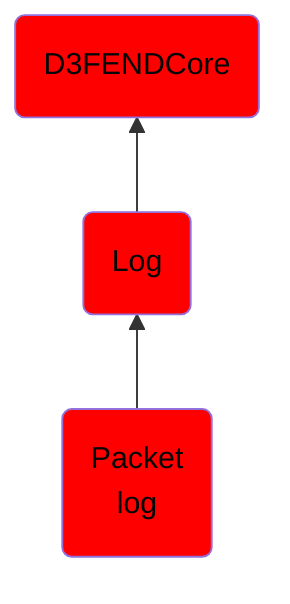

# Packet log

## Overview

### Definition
A log of all the network packet data captured from a network by a network sensor (i.e., packet analyzer),

### Examples
Not defined.

### Aliases
Not defined.

### URI
http://d3fend.mitre.org/ontologies/d3fend.owl#PacketLog

### Subclass Of

- [D3FENDCore](/docs/ontology/reference/model/D3FENDCore/D3FENDCore.md)
- [Log](/docs/ontology/reference/model/D3FENDCore/Log/Log.md)
- [Packet log](/docs/ontology/reference/model/D3FENDCore/Log/Packet%20log/Packet%20log.md)

### Ontology Reference
- [d3fend](http://d3fend.mitre.org/ontologies/d3fend.owl#)

## Properties
