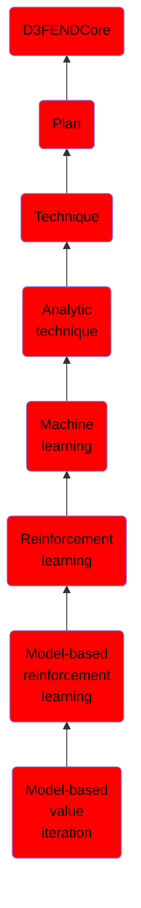

# Model-based value iteration

## Overview

### Definition
Value Iteration effectively reducesthe evaluation stage down to a single sweep of the states. Additionally, to improve things further, it combines the Policy Evaluation and Policy Improvement stages into a single update.

### Examples
Not defined.

### Aliases
Not defined.

### URI
http://d3fend.mitre.org/ontologies/d3fend.owl#Model-basedValueIteration

### Subclass Of

- [D3FENDCore](/docs/ontology/reference/model/D3FENDCore/D3FENDCore.md)
- [Plan](/docs/ontology/reference/model/D3FENDCore/Plan/Plan.md)
- [Technique](/docs/ontology/reference/model/D3FENDCore/Plan/Technique/Technique.md)
- [Analytic technique](/docs/ontology/reference/model/D3FENDCore/Plan/Technique/Analytic%20technique/Analytic%20technique.md)
- [Machine learning](/docs/ontology/reference/model/D3FENDCore/Plan/Technique/Analytic%20technique/Machine%20learning/Machine%20learning.md)
- [Reinforcement learning](/docs/ontology/reference/model/D3FENDCore/Plan/Technique/Analytic%20technique/Machine%20learning/Reinforcement%20learning/Reinforcement%20learning.md)
- [Model-based reinforcement learning](/docs/ontology/reference/model/D3FENDCore/Plan/Technique/Analytic%20technique/Machine%20learning/Reinforcement%20learning/Model-based%20reinforcement%20learning/Model-based%20reinforcement%20learning.md)
- [Model-based value iteration](/docs/ontology/reference/model/D3FENDCore/Plan/Technique/Analytic%20technique/Machine%20learning/Reinforcement%20learning/Model-based%20reinforcement%20learning/Model-based%20value%20iteration/Model-based%20value%20iteration.md)

### Ontology Reference
- [d3fend](http://d3fend.mitre.org/ontologies/d3fend.owl#)

## Properties
