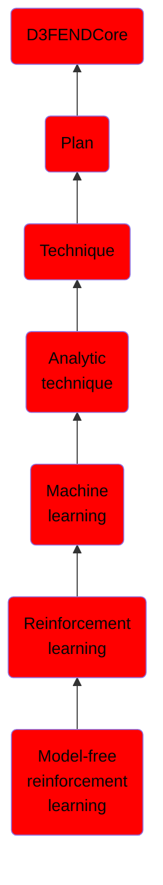

# Model-free reinforcement learning

## Overview

### Definition
In reinforcement learning (RL), a model-free algorithm (as opposed to a model-based one) is an algorithm which does not use the transition probability distribution (and the reward function) associated with the Markov decision process (MDP),which, in RL, represents the problem to be solved. The transition probability distribution (or transition model) and the reward function are often collectively called the "model" of the environment (or MDP), hence the name "model-free". A model-free RL algorithm can be thought of as an "explicit" trial-and-error algorithm. An example of a model-free algorithm is Q-learning.

### Examples
Not defined.

### Aliases
Not defined.

### URI
http://d3fend.mitre.org/ontologies/d3fend.owl#Model-freeReinforcementLearning

### Subclass Of

- [D3FENDCore](/docs/ontology/reference/model/D3FENDCore/D3FENDCore.md)
- [Plan](/docs/ontology/reference/model/D3FENDCore/Plan/Plan.md)
- [Technique](/docs/ontology/reference/model/D3FENDCore/Plan/Technique/Technique.md)
- [Analytic technique](/docs/ontology/reference/model/D3FENDCore/Plan/Technique/Analytic%20technique/Analytic%20technique.md)
- [Machine learning](/docs/ontology/reference/model/D3FENDCore/Plan/Technique/Analytic%20technique/Machine%20learning/Machine%20learning.md)
- [Reinforcement learning](/docs/ontology/reference/model/D3FENDCore/Plan/Technique/Analytic%20technique/Machine%20learning/Reinforcement%20learning/Reinforcement%20learning.md)
- [Model-free reinforcement learning](/docs/ontology/reference/model/D3FENDCore/Plan/Technique/Analytic%20technique/Machine%20learning/Reinforcement%20learning/Model-free%20reinforcement%20learning/Model-free%20reinforcement%20learning.md)

### Ontology Reference
- [d3fend](http://d3fend.mitre.org/ontologies/d3fend.owl#)

## Properties
