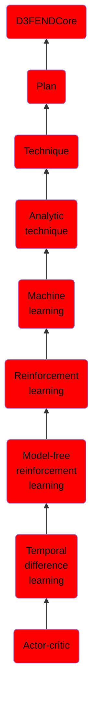

# Actor-critic

## Overview

### Definition
Actor-Critic is a Temporal Difference(TD) version of Policy gradient. It has two networks: Actor and Critic. The actor decided which action should be taken and critic inform the actor how good was the action and how it should adjust. The learning of the actor is based on policy gradient approach. In comparison, critics evaluate the action produced by the actor by computing the value function.

### Examples
Not defined.

### Aliases
Not defined.

### URI
http://d3fend.mitre.org/ontologies/d3fend.owl#Actor-Critic

### Subclass Of

- [D3FENDCore](/docs/ontology/reference/model/D3FENDCore/D3FENDCore.md)
- [Plan](/docs/ontology/reference/model/D3FENDCore/Plan/Plan.md)
- [Technique](/docs/ontology/reference/model/D3FENDCore/Plan/Technique/Technique.md)
- [Analytic technique](/docs/ontology/reference/model/D3FENDCore/Plan/Technique/Analytic%20technique/Analytic%20technique.md)
- [Machine learning](/docs/ontology/reference/model/D3FENDCore/Plan/Technique/Analytic%20technique/Machine%20learning/Machine%20learning.md)
- [Reinforcement learning](/docs/ontology/reference/model/D3FENDCore/Plan/Technique/Analytic%20technique/Machine%20learning/Reinforcement%20learning/Reinforcement%20learning.md)
- [Model-free reinforcement learning](/docs/ontology/reference/model/D3FENDCore/Plan/Technique/Analytic%20technique/Machine%20learning/Reinforcement%20learning/Model-free%20reinforcement%20learning/Model-free%20reinforcement%20learning.md)
- [Temporal difference learning](/docs/ontology/reference/model/D3FENDCore/Plan/Technique/Analytic%20technique/Machine%20learning/Reinforcement%20learning/Model-free%20reinforcement%20learning/Temporal%20difference%20learning/Temporal%20difference%20learning.md)
- [Actor-critic](/docs/ontology/reference/model/D3FENDCore/Plan/Technique/Analytic%20technique/Machine%20learning/Reinforcement%20learning/Model-free%20reinforcement%20learning/Temporal%20difference%20learning/Actor-critic/Actor-critic.md)

### Ontology Reference
- [d3fend](http://d3fend.mitre.org/ontologies/d3fend.owl#)

## Properties
