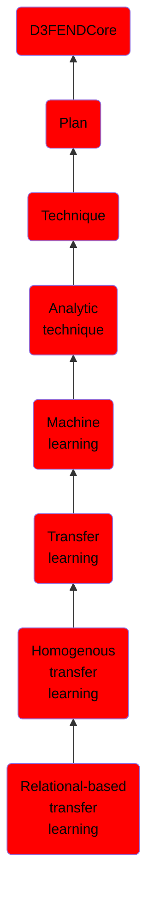

# Relational-based transfer learning

## Overview

### Definition
Relational-based Transfer Learning is a subfield of machine learning where knowledge and patterns learned from one domain, characterized by relational and structured data, are transferred to enhance the learning of another related domain. This approach leverages shared concepts, relations, and structures across domains, taking advantage of the rich semantic knowledge within relational data to improve learning performance in the target task.

### Examples
Not defined.

### Aliases
Not defined.

### URI
http://d3fend.mitre.org/ontologies/d3fend.owl#Relational-basedTransferLearning

### Subclass Of

- [D3FENDCore](/docs/ontology/reference/model/D3FENDCore/D3FENDCore.md)
- [Plan](/docs/ontology/reference/model/D3FENDCore/Plan/Plan.md)
- [Technique](/docs/ontology/reference/model/D3FENDCore/Plan/Technique/Technique.md)
- [Analytic technique](/docs/ontology/reference/model/D3FENDCore/Plan/Technique/Analytic%20technique/Analytic%20technique.md)
- [Machine learning](/docs/ontology/reference/model/D3FENDCore/Plan/Technique/Analytic%20technique/Machine%20learning/Machine%20learning.md)
- [Transfer learning](/docs/ontology/reference/model/D3FENDCore/Plan/Technique/Analytic%20technique/Machine%20learning/Transfer%20learning/Transfer%20learning.md)
- [Homogenous transfer learning](/docs/ontology/reference/model/D3FENDCore/Plan/Technique/Analytic%20technique/Machine%20learning/Transfer%20learning/Homogenous%20transfer%20learning/Homogenous%20transfer%20learning.md)
- [Relational-based transfer learning](/docs/ontology/reference/model/D3FENDCore/Plan/Technique/Analytic%20technique/Machine%20learning/Transfer%20learning/Homogenous%20transfer%20learning/Relational-based%20transfer%20learning/Relational-based%20transfer%20learning.md)

### Ontology Reference
- [d3fend](http://d3fend.mitre.org/ontologies/d3fend.owl#)

## Properties
