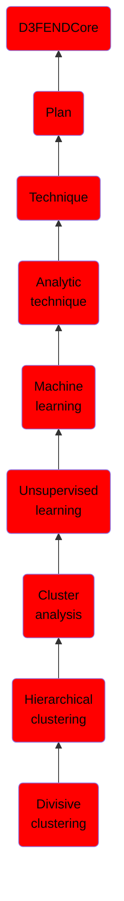

# Divisive clustering

## Overview

### Definition
A divisive clustering approach is a hierarchical, top-down approach to clustering a dataset.

### Examples
Not defined.

### Aliases
Not defined.

### URI
http://d3fend.mitre.org/ontologies/d3fend.owl#DivisiveClustering

### Subclass Of

- [D3FENDCore](/docs/ontology/reference/model/D3FENDCore/D3FENDCore.md)
- [Plan](/docs/ontology/reference/model/D3FENDCore/Plan/Plan.md)
- [Technique](/docs/ontology/reference/model/D3FENDCore/Plan/Technique/Technique.md)
- [Analytic technique](/docs/ontology/reference/model/D3FENDCore/Plan/Technique/Analytic%20technique/Analytic%20technique.md)
- [Machine learning](/docs/ontology/reference/model/D3FENDCore/Plan/Technique/Analytic%20technique/Machine%20learning/Machine%20learning.md)
- [Unsupervised learning](/docs/ontology/reference/model/D3FENDCore/Plan/Technique/Analytic%20technique/Machine%20learning/Unsupervised%20learning/Unsupervised%20learning.md)
- [Cluster analysis](/docs/ontology/reference/model/D3FENDCore/Plan/Technique/Analytic%20technique/Machine%20learning/Unsupervised%20learning/Cluster%20analysis/Cluster%20analysis.md)
- [Hierarchical clustering](/docs/ontology/reference/model/D3FENDCore/Plan/Technique/Analytic%20technique/Machine%20learning/Unsupervised%20learning/Cluster%20analysis/Hierarchical%20clustering/Hierarchical%20clustering.md)
- [Divisive clustering](/docs/ontology/reference/model/D3FENDCore/Plan/Technique/Analytic%20technique/Machine%20learning/Unsupervised%20learning/Cluster%20analysis/Hierarchical%20clustering/Divisive%20clustering/Divisive%20clustering.md)

### Ontology Reference
- [d3fend](http://d3fend.mitre.org/ontologies/d3fend.owl#)

## Properties
