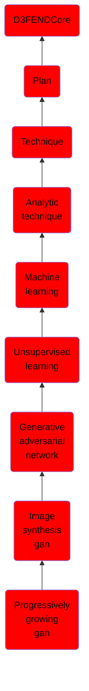

# Progressively growing gan

## Overview

### Definition
Progressive Growing GAN (ProGAN) is an extension to the GAN training process that allows for the stable training of generator models that can output large high-quality images.

### Examples
Not defined.

### Aliases
Not defined.

### URI
http://d3fend.mitre.org/ontologies/d3fend.owl#ProgressivelyGrowingGAN

### Subclass Of

- [D3FENDCore](/docs/ontology/reference/model/D3FENDCore/D3FENDCore.md)
- [Plan](/docs/ontology/reference/model/D3FENDCore/Plan/Plan.md)
- [Technique](/docs/ontology/reference/model/D3FENDCore/Plan/Technique/Technique.md)
- [Analytic technique](/docs/ontology/reference/model/D3FENDCore/Plan/Technique/Analytic%20technique/Analytic%20technique.md)
- [Machine learning](/docs/ontology/reference/model/D3FENDCore/Plan/Technique/Analytic%20technique/Machine%20learning/Machine%20learning.md)
- [Unsupervised learning](/docs/ontology/reference/model/D3FENDCore/Plan/Technique/Analytic%20technique/Machine%20learning/Unsupervised%20learning/Unsupervised%20learning.md)
- [Generative adversarial network](/docs/ontology/reference/model/D3FENDCore/Plan/Technique/Analytic%20technique/Machine%20learning/Unsupervised%20learning/Generative%20adversarial%20network/Generative%20adversarial%20network.md)
- [Image synthesis gan](/docs/ontology/reference/model/D3FENDCore/Plan/Technique/Analytic%20technique/Machine%20learning/Unsupervised%20learning/Generative%20adversarial%20network/Image%20synthesis%20gan/Image%20synthesis%20gan.md)
- [Progressively growing gan](/docs/ontology/reference/model/D3FENDCore/Plan/Technique/Analytic%20technique/Machine%20learning/Unsupervised%20learning/Generative%20adversarial%20network/Image%20synthesis%20gan/Progressively%20growing%20gan/Progressively%20growing%20gan.md)

### Ontology Reference
- [d3fend](http://d3fend.mitre.org/ontologies/d3fend.owl#)

## Properties
