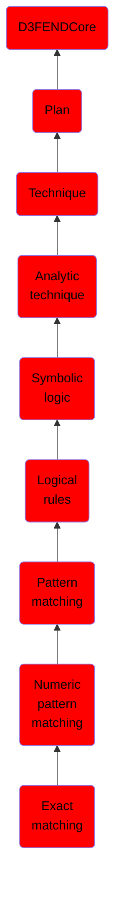

# Exact matching

## Overview

### Definition
Exact matching for numeric types is just the simple test for mathematical equivalence of the values being matched.

### Examples
Not defined.

### Aliases
Not defined.

### URI
http://d3fend.mitre.org/ontologies/d3fend.owl#ExactMatching

### Subclass Of

- [D3FENDCore](/docs/ontology/reference/model/D3FENDCore/D3FENDCore.md)
- [Plan](/docs/ontology/reference/model/D3FENDCore/Plan/Plan.md)
- [Technique](/docs/ontology/reference/model/D3FENDCore/Plan/Technique/Technique.md)
- [Analytic technique](/docs/ontology/reference/model/D3FENDCore/Plan/Technique/Analytic%20technique/Analytic%20technique.md)
- [Symbolic logic](/docs/ontology/reference/model/D3FENDCore/Plan/Technique/Analytic%20technique/Symbolic%20logic/Symbolic%20logic.md)
- [Logical rules](/docs/ontology/reference/model/D3FENDCore/Plan/Technique/Analytic%20technique/Symbolic%20logic/Logical%20rules/Logical%20rules.md)
- [Pattern matching](/docs/ontology/reference/model/D3FENDCore/Plan/Technique/Analytic%20technique/Symbolic%20logic/Logical%20rules/Pattern%20matching/Pattern%20matching.md)
- [Numeric pattern matching](/docs/ontology/reference/model/D3FENDCore/Plan/Technique/Analytic%20technique/Symbolic%20logic/Logical%20rules/Pattern%20matching/Numeric%20pattern%20matching/Numeric%20pattern%20matching.md)
- [Exact matching](/docs/ontology/reference/model/D3FENDCore/Plan/Technique/Analytic%20technique/Symbolic%20logic/Logical%20rules/Pattern%20matching/Numeric%20pattern%20matching/Exact%20matching/Exact%20matching.md)

### Ontology Reference
- [d3fend](http://d3fend.mitre.org/ontologies/d3fend.owl#)

## Properties
