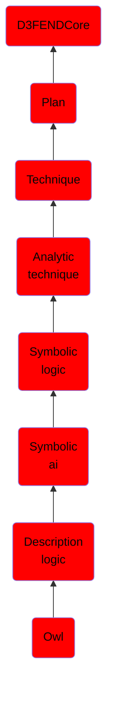

# Owl

## Overview

### Definition
The Web Ontology Language (OWL) is a family of knowledge representation languages for authoring ontologies.

### Examples
Not defined.

### Aliases
Not defined.

### URI
http://d3fend.mitre.org/ontologies/d3fend.owl#OWL

### Subclass Of

- [D3FENDCore](/docs/ontology/reference/model/D3FENDCore/D3FENDCore.md)
- [Plan](/docs/ontology/reference/model/D3FENDCore/Plan/Plan.md)
- [Technique](/docs/ontology/reference/model/D3FENDCore/Plan/Technique/Technique.md)
- [Analytic technique](/docs/ontology/reference/model/D3FENDCore/Plan/Technique/Analytic%20technique/Analytic%20technique.md)
- [Symbolic logic](/docs/ontology/reference/model/D3FENDCore/Plan/Technique/Analytic%20technique/Symbolic%20logic/Symbolic%20logic.md)
- [Symbolic ai](/docs/ontology/reference/model/D3FENDCore/Plan/Technique/Analytic%20technique/Symbolic%20logic/Symbolic%20ai/Symbolic%20ai.md)
- [Description logic](/docs/ontology/reference/model/D3FENDCore/Plan/Technique/Analytic%20technique/Symbolic%20logic/Symbolic%20ai/Description%20logic/Description%20logic.md)
- [Owl](/docs/ontology/reference/model/D3FENDCore/Plan/Technique/Analytic%20technique/Symbolic%20logic/Symbolic%20ai/Description%20logic/Owl/Owl.md)

### Ontology Reference
- [d3fend](http://d3fend.mitre.org/ontologies/d3fend.owl#)

## Properties
