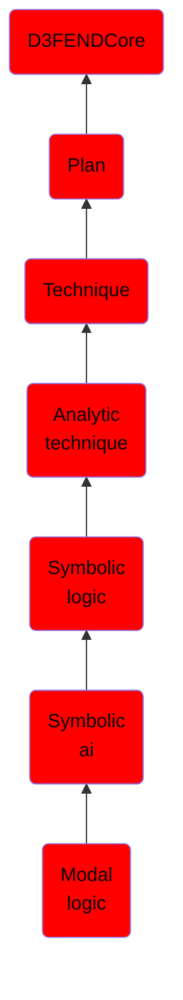

# Modal logic

## Overview

### Definition
Modal logic is a collection of formal systems developed to represent statements about necessity and possibility. It plays a major role in philosophy of language, epistemology, metaphysics, and natural language semantics.

### Examples
Not defined.

### Aliases
Not defined.

### URI
http://d3fend.mitre.org/ontologies/d3fend.owl#ModalLogic

### Subclass Of

- [D3FENDCore](/docs/ontology/reference/model/D3FENDCore/D3FENDCore.md)
- [Plan](/docs/ontology/reference/model/D3FENDCore/Plan/Plan.md)
- [Technique](/docs/ontology/reference/model/D3FENDCore/Plan/Technique/Technique.md)
- [Analytic technique](/docs/ontology/reference/model/D3FENDCore/Plan/Technique/Analytic%20technique/Analytic%20technique.md)
- [Symbolic logic](/docs/ontology/reference/model/D3FENDCore/Plan/Technique/Analytic%20technique/Symbolic%20logic/Symbolic%20logic.md)
- [Symbolic ai](/docs/ontology/reference/model/D3FENDCore/Plan/Technique/Analytic%20technique/Symbolic%20logic/Symbolic%20ai/Symbolic%20ai.md)
- [Modal logic](/docs/ontology/reference/model/D3FENDCore/Plan/Technique/Analytic%20technique/Symbolic%20logic/Symbolic%20ai/Modal%20logic/Modal%20logic.md)

### Ontology Reference
- [d3fend](http://d3fend.mitre.org/ontologies/d3fend.owl#)

## Properties
