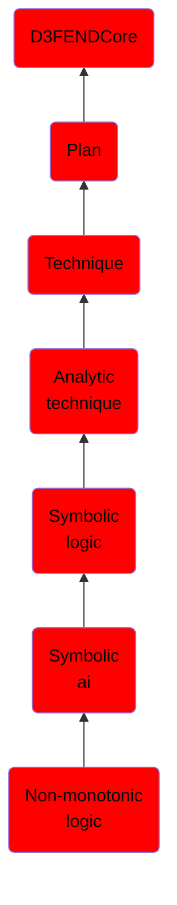

# Non-monotonic logic

## Overview

### Definition
Non-monotonic logic is a formal logic whose conclusion relation is not monotonic. In other words, non-monotonic logics are devised to capture and represent defeasible inferences (cf. defeasible reasoning), i.e., a kind of inference in which reasoners draw tentative conclusions, enabling reasoners to retract their conclusion(s) based on further evidence.

### Examples
Not defined.

### Aliases
Not defined.

### URI
http://d3fend.mitre.org/ontologies/d3fend.owl#Non-monotonicLogic

### Subclass Of

- [D3FENDCore](/docs/ontology/reference/model/D3FENDCore/D3FENDCore.md)
- [Plan](/docs/ontology/reference/model/D3FENDCore/Plan/Plan.md)
- [Technique](/docs/ontology/reference/model/D3FENDCore/Plan/Technique/Technique.md)
- [Analytic technique](/docs/ontology/reference/model/D3FENDCore/Plan/Technique/Analytic%20technique/Analytic%20technique.md)
- [Symbolic logic](/docs/ontology/reference/model/D3FENDCore/Plan/Technique/Analytic%20technique/Symbolic%20logic/Symbolic%20logic.md)
- [Symbolic ai](/docs/ontology/reference/model/D3FENDCore/Plan/Technique/Analytic%20technique/Symbolic%20logic/Symbolic%20ai/Symbolic%20ai.md)
- [Non-monotonic logic](/docs/ontology/reference/model/D3FENDCore/Plan/Technique/Analytic%20technique/Symbolic%20logic/Symbolic%20ai/Non-monotonic%20logic/Non-monotonic%20logic.md)

### Ontology Reference
- [d3fend](http://d3fend.mitre.org/ontologies/d3fend.owl#)

## Properties
