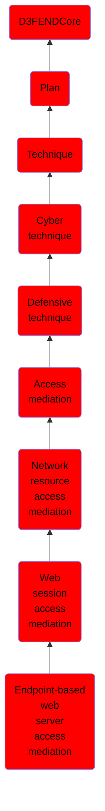

# Endpoint-based web server access mediation

## Overview

### Definition
Endpoint-based web server access mediation regulates web server access directly from user endpoints by implementing mechanisms such as client-side certificates and endpoint security software to authenticate devices and ensure compliant access.

### Examples
Not defined.

### Aliases
Not defined.

### URI
http://d3fend.mitre.org/ontologies/d3fend.owl#EndpointBasedWebServerAccessMediation

### Subclass Of

- [D3FENDCore](/docs/ontology/reference/model/D3FENDCore/D3FENDCore.md)
- [Plan](/docs/ontology/reference/model/D3FENDCore/Plan/Plan.md)
- [Technique](/docs/ontology/reference/model/D3FENDCore/Plan/Technique/Technique.md)
- [Cyber technique](/docs/ontology/reference/model/D3FENDCore/Plan/Technique/Cyber%20technique/Cyber%20technique.md)
- [Defensive technique](/docs/ontology/reference/model/D3FENDCore/Plan/Technique/Cyber%20technique/Defensive%20technique/Defensive%20technique.md)
- [Access mediation](/docs/ontology/reference/model/D3FENDCore/Plan/Technique/Cyber%20technique/Defensive%20technique/Access%20mediation/Access%20mediation.md)
- [Network resource access mediation](/docs/ontology/reference/model/D3FENDCore/Plan/Technique/Cyber%20technique/Defensive%20technique/Access%20mediation/Network%20resource%20access%20mediation/Network%20resource%20access%20mediation.md)
- [Web session access mediation](/docs/ontology/reference/model/D3FENDCore/Plan/Technique/Cyber%20technique/Defensive%20technique/Access%20mediation/Network%20resource%20access%20mediation/Web%20session%20access%20mediation/Web%20session%20access%20mediation.md)
- [Endpoint-based web server access mediation](/docs/ontology/reference/model/D3FENDCore/Plan/Technique/Cyber%20technique/Defensive%20technique/Access%20mediation/Network%20resource%20access%20mediation/Web%20session%20access%20mediation/Endpoint-based%20web%20server%20access%20mediation/Endpoint-based%20web%20server%20access%20mediation.md)

### Ontology Reference
- [d3fend](http://d3fend.mitre.org/ontologies/d3fend.owl#)

## Properties
