# File magic byte verification

## Overview

### Definition
Utilizing the magic number to verify the file

### Examples
Not defined.

### Aliases
Not defined.

### URI
http://d3fend.mitre.org/ontologies/d3fend.owl#FileMagicByteVerification

### Subclass Of

```mermaid
graph BT
    d3fend.owl#FileMagicByteVerification(File<br>magic<br>byte<br>verification):::d3fend-->d3fend.owl#FileMetadataValueVerification
    d3fend.owl#FileMetadataValueVerification(File<br>metadata<br>value<br>verification):::d3fend-->d3fend.owl#FileFormatVerification
    d3fend.owl#FileFormatVerification(File<br>format<br>verification):::d3fend-->d3fend.owl#ContentValidation
    d3fend.owl#ContentValidation(Content<br>validation):::d3fend-->d3fend.owl#ContentFiltering
    d3fend.owl#ContentFiltering(Content<br>filtering):::d3fend-->d3fend.owl#DefensiveTechnique
    d3fend.owl#DefensiveTechnique(Defensive<br>technique):::d3fend-->d3fend.owl#CyberTechnique
    d3fend.owl#CyberTechnique(Cyber<br>technique):::d3fend-->d3fend.owl#Technique
    d3fend.owl#Technique(Technique):::d3fend-->d3fend.owl#Plan
    d3fend.owl#Plan(Plan):::d3fend-->d3fend.owl#D3FENDCore
    d3fend.owl#D3FENDCore(D3FENDCore):::d3fend
    
    classDef bfo fill:#97c1fb,color:#060606
    classDef cco fill:#e4c51e,color:#060606
    classDef abi fill:#48DD82,color:#060606
    classDef attack fill:#FF0000,color:#060606
    classDef d3fend fill:#FF0000,color:#060606
```

- [D3FENDCore](/docs/ontology/reference/model/D3FENDCore/D3FENDCore.md)
- [Plan](/docs/ontology/reference/model/D3FENDCore/Plan/Plan.md)
- [Technique](/docs/ontology/reference/model/D3FENDCore/Plan/Technique/Technique.md)
- [Cyber technique](/docs/ontology/reference/model/D3FENDCore/Plan/Technique/Cyber%20technique/Cyber%20technique.md)
- [Defensive technique](/docs/ontology/reference/model/D3FENDCore/Plan/Technique/Cyber%20technique/Defensive%20technique/Defensive%20technique.md)
- [Content filtering](/docs/ontology/reference/model/D3FENDCore/Plan/Technique/Cyber%20technique/Defensive%20technique/Content%20filtering/Content%20filtering.md)
- [Content validation](/docs/ontology/reference/model/D3FENDCore/Plan/Technique/Cyber%20technique/Defensive%20technique/Content%20filtering/Content%20validation/Content%20validation.md)
- [File format verification](/docs/ontology/reference/model/D3FENDCore/Plan/Technique/Cyber%20technique/Defensive%20technique/Content%20filtering/Content%20validation/File%20format%20verification/File%20format%20verification.md)
- [File metadata value verification](/docs/ontology/reference/model/D3FENDCore/Plan/Technique/Cyber%20technique/Defensive%20technique/Content%20filtering/Content%20validation/File%20format%20verification/File%20metadata%20value%20verification/File%20metadata%20value%20verification.md)
- [File magic byte verification](/docs/ontology/reference/model/D3FENDCore/Plan/Technique/Cyber%20technique/Defensive%20technique/Content%20filtering/Content%20validation/File%20format%20verification/File%20metadata%20value%20verification/File%20magic%20byte%20verification/File%20magic%20byte%20verification.md)

### Ontology Reference
- [d3fend](http://d3fend.mitre.org/ontologies/d3fend.owl#)

## Properties
