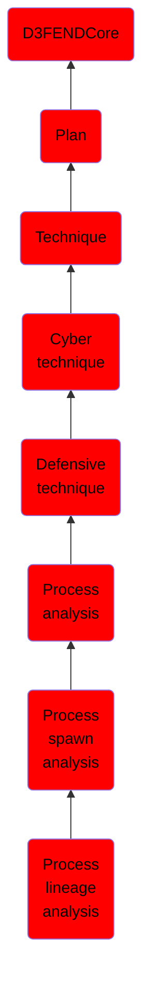

# Process lineage analysis

## Overview

### Definition
Identification of suspicious processes executing on an end-point device by examining the ancestry and siblings of a process, and the associated metadata of each node on the tree, such as process execution, duration, and order relative to siblings and ancestors.

### Examples
Not defined.

### Aliases
Not defined.

### URI
http://d3fend.mitre.org/ontologies/d3fend.owl#ProcessLineageAnalysis

### Subclass Of

- [D3FENDCore](/docs/ontology/reference/model/D3FENDCore/D3FENDCore.md)
- [Plan](/docs/ontology/reference/model/D3FENDCore/Plan/Plan.md)
- [Technique](/docs/ontology/reference/model/D3FENDCore/Plan/Technique/Technique.md)
- [Cyber technique](/docs/ontology/reference/model/D3FENDCore/Plan/Technique/Cyber%20technique/Cyber%20technique.md)
- [Defensive technique](/docs/ontology/reference/model/D3FENDCore/Plan/Technique/Cyber%20technique/Defensive%20technique/Defensive%20technique.md)
- [Process analysis](/docs/ontology/reference/model/D3FENDCore/Plan/Technique/Cyber%20technique/Defensive%20technique/Process%20analysis/Process%20analysis.md)
- [Process spawn analysis](/docs/ontology/reference/model/D3FENDCore/Plan/Technique/Cyber%20technique/Defensive%20technique/Process%20analysis/Process%20spawn%20analysis/Process%20spawn%20analysis.md)
- [Process lineage analysis](/docs/ontology/reference/model/D3FENDCore/Plan/Technique/Cyber%20technique/Defensive%20technique/Process%20analysis/Process%20spawn%20analysis/Process%20lineage%20analysis/Process%20lineage%20analysis.md)

### Ontology Reference
- [d3fend](http://d3fend.mitre.org/ontologies/d3fend.owl#)

## Properties
