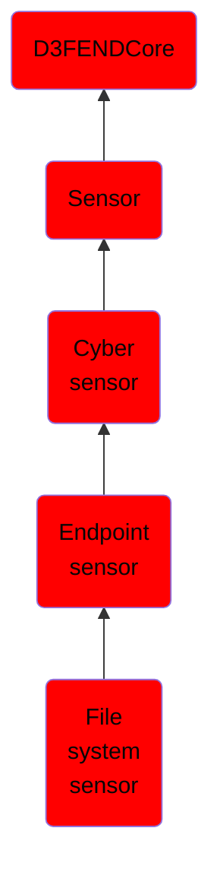

# File system sensor

## Overview

### Definition
Collects files and file metadata on an endpoint.

### Examples
Not defined.

### Aliases
Not defined.

### URI
http://d3fend.mitre.org/ontologies/d3fend.owl#FileSystemSensor

### Subclass Of

- [D3FENDCore](/docs/ontology/reference/model/D3FENDCore/D3FENDCore.md)
- [Sensor](/docs/ontology/reference/model/D3FENDCore/Sensor/Sensor.md)
- [Cyber sensor](/docs/ontology/reference/model/D3FENDCore/Sensor/Cyber%20sensor/Cyber%20sensor.md)
- [Endpoint sensor](/docs/ontology/reference/model/D3FENDCore/Sensor/Cyber%20sensor/Endpoint%20sensor/Endpoint%20sensor.md)
- [File system sensor](/docs/ontology/reference/model/D3FENDCore/Sensor/Cyber%20sensor/Endpoint%20sensor/File%20system%20sensor/File%20system%20sensor.md)

### Ontology Reference
- [d3fend](http://d3fend.mitre.org/ontologies/d3fend.owl#)

## Properties
