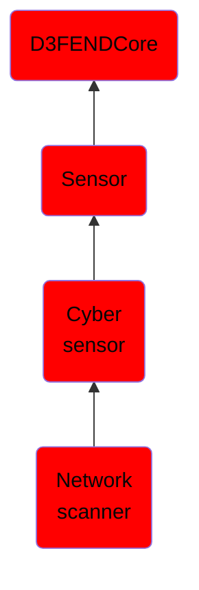

# Network scanner

## Overview

### Definition
A network scanner is a computer program used to retrieve usernames and info on groups, shares, and services of networked computers. This type of program scans networks for vulnerabilities in the security of that network. If there is a vulnerability with the security of the network, it will send a report back to a hacker who may use this info to exploit that network glitch to gain entry to the network or for other malicious activities. Ethical hackers often also use the information to remove the glitches and strengthen their network.

### Examples
Not defined.

### Aliases
Network Enumerator

### URI
http://d3fend.mitre.org/ontologies/d3fend.owl#NetworkScanner

### Subclass Of

- [D3FENDCore](/docs/ontology/reference/model/D3FENDCore/D3FENDCore.md)
- [Sensor](/docs/ontology/reference/model/D3FENDCore/Sensor/Sensor.md)
- [Cyber sensor](/docs/ontology/reference/model/D3FENDCore/Sensor/Cyber%20sensor/Cyber%20sensor.md)
- [Network scanner](/docs/ontology/reference/model/D3FENDCore/Sensor/Cyber%20sensor/Network%20scanner/Network%20scanner.md)

### Ontology Reference
- [d3fend](http://d3fend.mitre.org/ontologies/d3fend.owl#)

## Properties
