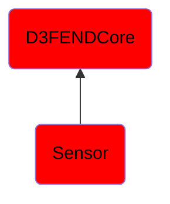

# Sensor

## Overview

### Definition
In the broadest definition, a sensor is a device, module, machine, or subsystem that detects events or changes in its environment and sends the information to other electronics, frequently a computer.

### Examples
Not defined.

### Aliases
Not defined.

### URI
http://d3fend.mitre.org/ontologies/d3fend.owl#Sensor

### Subclass Of

- [D3FENDCore](/docs/ontology/reference/model/D3FENDCore/D3FENDCore.md)
- [Sensor](/docs/ontology/reference/model/D3FENDCore/Sensor/Sensor.md)

### Ontology Reference
- [d3fend](http://d3fend.mitre.org/ontologies/d3fend.owl#)

## Properties
