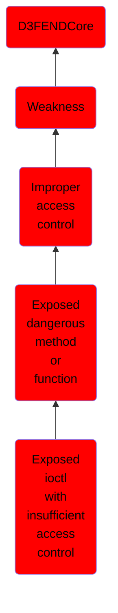

# Exposed ioctl with insufficient access control

## Overview

### Definition
Not defined.

### Examples
Not defined.

### Aliases
Not defined.

### URI
http://d3fend.mitre.org/ontologies/d3fend.owl#CWE-782

### Subclass Of

- [D3FENDCore](/docs/ontology/reference/model/D3FENDCore/D3FENDCore.md)
- [Weakness](/docs/ontology/reference/model/D3FENDCore/Weakness/Weakness.md)
- [Improper access control](/docs/ontology/reference/model/D3FENDCore/Weakness/Improper%20access%20control/Improper%20access%20control.md)
- [Exposed dangerous method or function](/docs/ontology/reference/model/D3FENDCore/Weakness/Improper%20access%20control/Exposed%20dangerous%20method%20or%20function/Exposed%20dangerous%20method%20or%20function.md)
- [Exposed ioctl with insufficient access control](/docs/ontology/reference/model/D3FENDCore/Weakness/Improper%20access%20control/Exposed%20dangerous%20method%20or%20function/Exposed%20ioctl%20with%20insufficient%20access%20control/Exposed%20ioctl%20with%20insufficient%20access%20control.md)

### Ontology Reference
- [d3fend](http://d3fend.mitre.org/ontologies/d3fend.owl#)

## Properties
### Object Properties
| Ontology | Label | Definition | Example | Domain | Range | Inverse Of |
|----------|-------|------------|---------|--------|-------|------------|
| d3fend | [may-be-weakness-of](http://d3fend.mitre.org/ontologies/d3fend.owl#may-be-weakness-of) |  |  | [Weakness](/docs/ontology/reference/model/D3FENDCore/Weakness/Weakness.md) | [Artifact](/docs/ontology/reference/model/D3FENDCore/Artifact/Artifact.md) | [may-have-weakness](http://d3fend.mitre.org/ontologies/d3fend.owl#may-have-weakness) |

