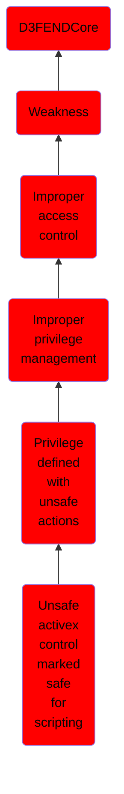

# Unsafe activex control marked safe for scripting

## Overview

### Definition
Not defined.

### Examples
Not defined.

### Aliases
Not defined.

### URI
http://d3fend.mitre.org/ontologies/d3fend.owl#CWE-623

### Subclass Of

- [D3FENDCore](/docs/ontology/reference/model/D3FENDCore/D3FENDCore.md)
- [Weakness](/docs/ontology/reference/model/D3FENDCore/Weakness/Weakness.md)
- [Improper access control](/docs/ontology/reference/model/D3FENDCore/Weakness/Improper%20access%20control/Improper%20access%20control.md)
- [Improper privilege management](/docs/ontology/reference/model/D3FENDCore/Weakness/Improper%20access%20control/Improper%20privilege%20management/Improper%20privilege%20management.md)
- [Privilege defined with unsafe actions](/docs/ontology/reference/model/D3FENDCore/Weakness/Improper%20access%20control/Improper%20privilege%20management/Privilege%20defined%20with%20unsafe%20actions/Privilege%20defined%20with%20unsafe%20actions.md)
- [Unsafe activex control marked safe for scripting](/docs/ontology/reference/model/D3FENDCore/Weakness/Improper%20access%20control/Improper%20privilege%20management/Privilege%20defined%20with%20unsafe%20actions/Unsafe%20activex%20control%20marked%20safe%20for%20scripting/Unsafe%20activex%20control%20marked%20safe%20for%20scripting.md)

### Ontology Reference
- [d3fend](http://d3fend.mitre.org/ontologies/d3fend.owl#)

## Properties
### Object Properties
| Ontology | Label | Definition | Example | Domain | Range | Inverse Of |
|----------|-------|------------|---------|--------|-------|------------|
| d3fend | [may-be-weakness-of](http://d3fend.mitre.org/ontologies/d3fend.owl#may-be-weakness-of) |  |  | [Weakness](/docs/ontology/reference/model/D3FENDCore/Weakness/Weakness.md) | [Artifact](/docs/ontology/reference/model/D3FENDCore/Artifact/Artifact.md) | [may-have-weakness](http://d3fend.mitre.org/ontologies/d3fend.owl#may-have-weakness) |

