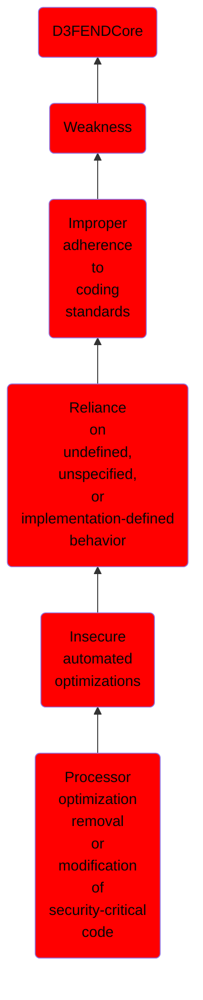

# Processor optimization removal or modification of security-critical code

## Overview

### Definition
Not defined.

### Examples
Not defined.

### Aliases
Not defined.

### URI
http://d3fend.mitre.org/ontologies/d3fend.owl#CWE-1037

### Subclass Of

- [D3FENDCore](/docs/ontology/reference/model/D3FENDCore/D3FENDCore.md)
- [Weakness](/docs/ontology/reference/model/D3FENDCore/Weakness/Weakness.md)
- [Improper adherence to coding standards](/docs/ontology/reference/model/D3FENDCore/Weakness/Improper%20adherence%20to%20coding%20standards/Improper%20adherence%20to%20coding%20standards.md)
- [Reliance on undefined, unspecified, or implementation-defined behavior](/docs/ontology/reference/model/D3FENDCore/Weakness/Improper%20adherence%20to%20coding%20standards/Reliance%20on%20undefined%2C%20unspecified%2C%20or%20implementation-defined%20behavior/Reliance%20on%20undefined%2C%20unspecified%2C%20or%20implementation-defined%20behavior.md)
- [Insecure automated optimizations](/docs/ontology/reference/model/D3FENDCore/Weakness/Improper%20adherence%20to%20coding%20standards/Reliance%20on%20undefined%2C%20unspecified%2C%20or%20implementation-defined%20behavior/Insecure%20automated%20optimizations/Insecure%20automated%20optimizations.md)
- [Processor optimization removal or modification of security-critical code](/docs/ontology/reference/model/D3FENDCore/Weakness/Improper%20adherence%20to%20coding%20standards/Reliance%20on%20undefined%2C%20unspecified%2C%20or%20implementation-defined%20behavior/Insecure%20automated%20optimizations/Processor%20optimization%20removal%20or%20modification%20of%20security-critical%20code/Processor%20optimization%20removal%20or%20modification%20of%20security-critical%20code.md)

### Ontology Reference
- [d3fend](http://d3fend.mitre.org/ontologies/d3fend.owl#)

## Properties
### Object Properties
| Ontology | Label | Definition | Example | Domain | Range | Inverse Of |
|----------|-------|------------|---------|--------|-------|------------|
| d3fend | [may-be-weakness-of](http://d3fend.mitre.org/ontologies/d3fend.owl#may-be-weakness-of) |  |  | [Weakness](/docs/ontology/reference/model/D3FENDCore/Weakness/Weakness.md) | [Artifact](/docs/ontology/reference/model/D3FENDCore/Artifact/Artifact.md) | [may-have-weakness](http://d3fend.mitre.org/ontologies/d3fend.owl#may-have-weakness) |

