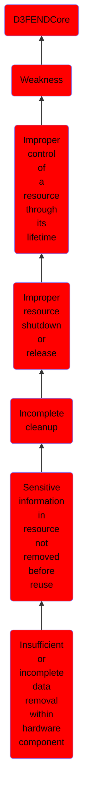

# Insufficient or incomplete data removal within hardware component

## Overview

### Definition
Not defined.

### Examples
Not defined.

### Aliases
Not defined.

### URI
http://d3fend.mitre.org/ontologies/d3fend.owl#CWE-1301

### Subclass Of

- [D3FENDCore](/docs/ontology/reference/model/D3FENDCore/D3FENDCore.md)
- [Weakness](/docs/ontology/reference/model/D3FENDCore/Weakness/Weakness.md)
- [Improper control of a resource through its lifetime](/docs/ontology/reference/model/D3FENDCore/Weakness/Improper%20control%20of%20a%20resource%20through%20its%20lifetime/Improper%20control%20of%20a%20resource%20through%20its%20lifetime.md)
- [Improper resource shutdown or release](/docs/ontology/reference/model/D3FENDCore/Weakness/Improper%20control%20of%20a%20resource%20through%20its%20lifetime/Improper%20resource%20shutdown%20or%20release/Improper%20resource%20shutdown%20or%20release.md)
- [Incomplete cleanup](/docs/ontology/reference/model/D3FENDCore/Weakness/Improper%20control%20of%20a%20resource%20through%20its%20lifetime/Improper%20resource%20shutdown%20or%20release/Incomplete%20cleanup/Incomplete%20cleanup.md)
- [Sensitive information in resource not removed before reuse](/docs/ontology/reference/model/D3FENDCore/Weakness/Improper%20control%20of%20a%20resource%20through%20its%20lifetime/Improper%20resource%20shutdown%20or%20release/Incomplete%20cleanup/Sensitive%20information%20in%20resource%20not%20removed%20before%20reuse/Sensitive%20information%20in%20resource%20not%20removed%20before%20reuse.md)
- [Insufficient or incomplete data removal within hardware component](/docs/ontology/reference/model/D3FENDCore/Weakness/Improper%20control%20of%20a%20resource%20through%20its%20lifetime/Improper%20resource%20shutdown%20or%20release/Incomplete%20cleanup/Sensitive%20information%20in%20resource%20not%20removed%20before%20reuse/Insufficient%20or%20incomplete%20data%20removal%20within%20hardware%20component/Insufficient%20or%20incomplete%20data%20removal%20within%20hardware%20component.md)

### Ontology Reference
- [d3fend](http://d3fend.mitre.org/ontologies/d3fend.owl#)

## Properties
### Object Properties
| Ontology | Label | Definition | Example | Domain | Range | Inverse Of |
|----------|-------|------------|---------|--------|-------|------------|
| d3fend | [may-be-weakness-of](http://d3fend.mitre.org/ontologies/d3fend.owl#may-be-weakness-of) |  |  | [Weakness](/docs/ontology/reference/model/D3FENDCore/Weakness/Weakness.md) | [Artifact](/docs/ontology/reference/model/D3FENDCore/Artifact/Artifact.md) | [may-have-weakness](http://d3fend.mitre.org/ontologies/d3fend.owl#may-have-weakness) |

