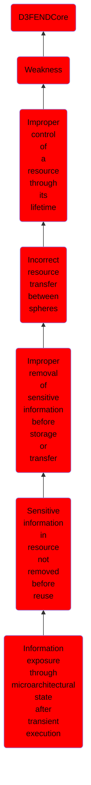

# Information exposure through microarchitectural state after transient execution

## Overview

### Definition
Not defined.

### Examples
Not defined.

### Aliases
Not defined.

### URI
http://d3fend.mitre.org/ontologies/d3fend.owl#CWE-1342

### Subclass Of

- [D3FENDCore](/docs/ontology/reference/model/D3FENDCore/D3FENDCore.md)
- [Weakness](/docs/ontology/reference/model/D3FENDCore/Weakness/Weakness.md)
- [Improper control of a resource through its lifetime](/docs/ontology/reference/model/D3FENDCore/Weakness/Improper%20control%20of%20a%20resource%20through%20its%20lifetime/Improper%20control%20of%20a%20resource%20through%20its%20lifetime.md)
- [Incorrect resource transfer between spheres](/docs/ontology/reference/model/D3FENDCore/Weakness/Improper%20control%20of%20a%20resource%20through%20its%20lifetime/Incorrect%20resource%20transfer%20between%20spheres/Incorrect%20resource%20transfer%20between%20spheres.md)
- [Improper removal of sensitive information before storage or transfer](/docs/ontology/reference/model/D3FENDCore/Weakness/Improper%20control%20of%20a%20resource%20through%20its%20lifetime/Incorrect%20resource%20transfer%20between%20spheres/Improper%20removal%20of%20sensitive%20information%20before%20storage%20or%20transfer/Improper%20removal%20of%20sensitive%20information%20before%20storage%20or%20transfer.md)
- [Sensitive information in resource not removed before reuse](/docs/ontology/reference/model/D3FENDCore/Weakness/Improper%20control%20of%20a%20resource%20through%20its%20lifetime/Incorrect%20resource%20transfer%20between%20spheres/Improper%20removal%20of%20sensitive%20information%20before%20storage%20or%20transfer/Sensitive%20information%20in%20resource%20not%20removed%20before%20reuse/Sensitive%20information%20in%20resource%20not%20removed%20before%20reuse.md)
- [Information exposure through microarchitectural state after transient execution](/docs/ontology/reference/model/D3FENDCore/Weakness/Improper%20control%20of%20a%20resource%20through%20its%20lifetime/Incorrect%20resource%20transfer%20between%20spheres/Improper%20removal%20of%20sensitive%20information%20before%20storage%20or%20transfer/Sensitive%20information%20in%20resource%20not%20removed%20before%20reuse/Information%20exposure%20through%20microarchitectural%20state%20after%20transient%20execution/Information%20exposure%20through%20microarchitectural%20state%20after%20transient%20execution.md)

### Ontology Reference
- [d3fend](http://d3fend.mitre.org/ontologies/d3fend.owl#)

## Properties
### Object Properties
| Ontology | Label | Definition | Example | Domain | Range | Inverse Of |
|----------|-------|------------|---------|--------|-------|------------|
| d3fend | [may-be-weakness-of](http://d3fend.mitre.org/ontologies/d3fend.owl#may-be-weakness-of) |  |  | [Weakness](/docs/ontology/reference/model/D3FENDCore/Weakness/Weakness.md) | [Artifact](/docs/ontology/reference/model/D3FENDCore/Artifact/Artifact.md) | [may-have-weakness](http://d3fend.mitre.org/ontologies/d3fend.owl#may-have-weakness) |

