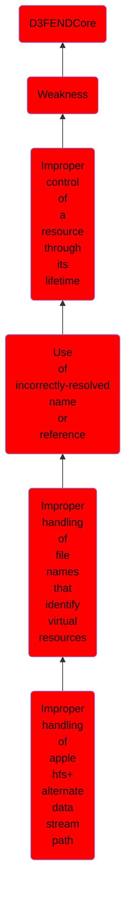

# Improper handling of apple hfs+ alternate data stream path

## Overview

### Definition
Not defined.

### Examples
Not defined.

### Aliases
Not defined.

### URI
http://d3fend.mitre.org/ontologies/d3fend.owl#CWE-72

### Subclass Of

- [D3FENDCore](/docs/ontology/reference/model/D3FENDCore/D3FENDCore.md)
- [Weakness](/docs/ontology/reference/model/D3FENDCore/Weakness/Weakness.md)
- [Improper control of a resource through its lifetime](/docs/ontology/reference/model/D3FENDCore/Weakness/Improper%20control%20of%20a%20resource%20through%20its%20lifetime/Improper%20control%20of%20a%20resource%20through%20its%20lifetime.md)
- [Use of incorrectly-resolved name or reference](/docs/ontology/reference/model/D3FENDCore/Weakness/Improper%20control%20of%20a%20resource%20through%20its%20lifetime/Use%20of%20incorrectly-resolved%20name%20or%20reference/Use%20of%20incorrectly-resolved%20name%20or%20reference.md)
- [Improper handling of file names that identify virtual resources](/docs/ontology/reference/model/D3FENDCore/Weakness/Improper%20control%20of%20a%20resource%20through%20its%20lifetime/Use%20of%20incorrectly-resolved%20name%20or%20reference/Improper%20handling%20of%20file%20names%20that%20identify%20virtual%20resources/Improper%20handling%20of%20file%20names%20that%20identify%20virtual%20resources.md)
- [Improper handling of apple hfs+ alternate data stream path](/docs/ontology/reference/model/D3FENDCore/Weakness/Improper%20control%20of%20a%20resource%20through%20its%20lifetime/Use%20of%20incorrectly-resolved%20name%20or%20reference/Improper%20handling%20of%20file%20names%20that%20identify%20virtual%20resources/Improper%20handling%20of%20apple%20hfs%2B%20alternate%20data%20stream%20path/Improper%20handling%20of%20apple%20hfs%2B%20alternate%20data%20stream%20path.md)

### Ontology Reference
- [d3fend](http://d3fend.mitre.org/ontologies/d3fend.owl#)

## Properties
### Object Properties
| Ontology | Label | Definition | Example | Domain | Range | Inverse Of |
|----------|-------|------------|---------|--------|-------|------------|
| d3fend | [may-be-weakness-of](http://d3fend.mitre.org/ontologies/d3fend.owl#may-be-weakness-of) |  |  | [Weakness](/docs/ontology/reference/model/D3FENDCore/Weakness/Weakness.md) | [Artifact](/docs/ontology/reference/model/D3FENDCore/Artifact/Artifact.md) | [may-have-weakness](http://d3fend.mitre.org/ontologies/d3fend.owl#may-have-weakness) |

