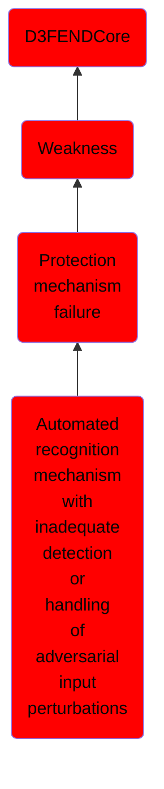

# Automated recognition mechanism with inadequate detection or handling of adversarial input perturbations

## Overview

### Definition
Not defined.

### Examples
Not defined.

### Aliases
Not defined.

### URI
http://d3fend.mitre.org/ontologies/d3fend.owl#CWE-1039

### Subclass Of

- [D3FENDCore](/docs/ontology/reference/model/D3FENDCore/D3FENDCore.md)
- [Weakness](/docs/ontology/reference/model/D3FENDCore/Weakness/Weakness.md)
- [Protection mechanism failure](/docs/ontology/reference/model/D3FENDCore/Weakness/Protection%20mechanism%20failure/Protection%20mechanism%20failure.md)
- [Automated recognition mechanism with inadequate detection or handling of adversarial input perturbations](/docs/ontology/reference/model/D3FENDCore/Weakness/Protection%20mechanism%20failure/Automated%20recognition%20mechanism%20with%20inadequate%20detection%20or%20handling%20of%20adversarial%20input%20perturbations/Automated%20recognition%20mechanism%20with%20inadequate%20detection%20or%20handling%20of%20adversarial%20input%20perturbations.md)

### Ontology Reference
- [d3fend](http://d3fend.mitre.org/ontologies/d3fend.owl#)

## Properties
### Object Properties
| Ontology | Label | Definition | Example | Domain | Range | Inverse Of |
|----------|-------|------------|---------|--------|-------|------------|
| d3fend | [may-be-weakness-of](http://d3fend.mitre.org/ontologies/d3fend.owl#may-be-weakness-of) |  |  | [Weakness](/docs/ontology/reference/model/D3FENDCore/Weakness/Weakness.md) | [Artifact](/docs/ontology/reference/model/D3FENDCore/Artifact/Artifact.md) | [may-have-weakness](http://d3fend.mitre.org/ontologies/d3fend.owl#may-have-weakness) |

