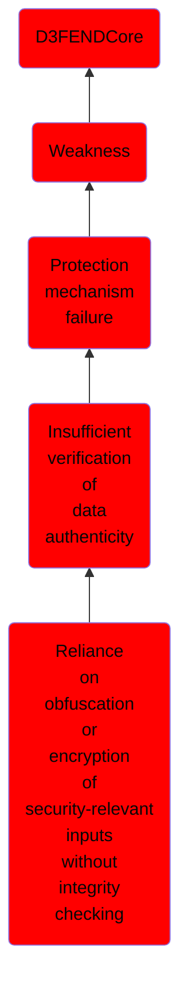

# Reliance on obfuscation or encryption of security-relevant inputs without integrity checking

## Overview

### Definition
Not defined.

### Examples
Not defined.

### Aliases
Not defined.

### URI
http://d3fend.mitre.org/ontologies/d3fend.owl#CWE-649

### Subclass Of

- [D3FENDCore](/docs/ontology/reference/model/D3FENDCore/D3FENDCore.md)
- [Weakness](/docs/ontology/reference/model/D3FENDCore/Weakness/Weakness.md)
- [Protection mechanism failure](/docs/ontology/reference/model/D3FENDCore/Weakness/Protection%20mechanism%20failure/Protection%20mechanism%20failure.md)
- [Insufficient verification of data authenticity](/docs/ontology/reference/model/D3FENDCore/Weakness/Protection%20mechanism%20failure/Insufficient%20verification%20of%20data%20authenticity/Insufficient%20verification%20of%20data%20authenticity.md)
- [Reliance on obfuscation or encryption of security-relevant inputs without integrity checking](/docs/ontology/reference/model/D3FENDCore/Weakness/Protection%20mechanism%20failure/Insufficient%20verification%20of%20data%20authenticity/Reliance%20on%20obfuscation%20or%20encryption%20of%20security-relevant%20inputs%20without%20integrity%20checking/Reliance%20on%20obfuscation%20or%20encryption%20of%20security-relevant%20inputs%20without%20integrity%20checking.md)

### Ontology Reference
- [d3fend](http://d3fend.mitre.org/ontologies/d3fend.owl#)

## Properties
### Object Properties
| Ontology | Label | Definition | Example | Domain | Range | Inverse Of |
|----------|-------|------------|---------|--------|-------|------------|
| d3fend | [may-be-weakness-of](http://d3fend.mitre.org/ontologies/d3fend.owl#may-be-weakness-of) |  |  | [Weakness](/docs/ontology/reference/model/D3FENDCore/Weakness/Weakness.md) | [Artifact](/docs/ontology/reference/model/D3FENDCore/Artifact/Artifact.md) | [may-have-weakness](http://d3fend.mitre.org/ontologies/d3fend.owl#may-have-weakness) |

