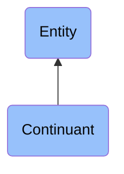

# Continuant

## Overview

### Definition
(Elucidation) A continuant is an entity that persists, endures, or continues to exist through time while maintaining its identity

### Examples
A human being; a tennis ball; a cave; a region of space; someone's temperature

### Aliases
Not defined.

### URI
http://purl.obolibrary.org/obo/BFO_0000002

### Subclass Of

- [Entity](/docs/ontology/reference/model/Entity/Entity.md)
- [Continuant](/docs/ontology/reference/model/Entity/Continuant/Continuant.md)

### Ontology Reference
- [bfo](http://purl.obolibrary.org/obo/)

## Properties
### Object Properties
| Ontology | Label | Definition | Example | Domain | Range | Inverse Of |
|----------|-------|------------|---------|--------|-------|------------|
| bfo | [exists at](http://purl.obolibrary.org/obo/BFO_0000108) | (Elucidation) exists at is a relation between a particular and some temporal region at which the particular exists | First World War exists at 1914-1916; Mexico exists at January 1, 2000 | [entity](/docs/ontology/reference/model/Entity/Entity.md) | [temporal region](/docs/ontology/reference/model/Entity/Occurrent/Temporal%20region/Temporal%20region.md) |  |
| bfo | [continuant part of](http://purl.obolibrary.org/obo/BFO_0000176) | b continuant part of c =Def b and c are continuants & there is some time t such that b and c exist at t & b continuant part of c at t | Milk teeth continuant part of human; surgically removed tumour continuant part of organism | [continuant](/docs/ontology/reference/model/Entity/Continuant/Continuant.md) | [continuant](/docs/ontology/reference/model/Entity/Continuant/Continuant.md) | [has continuant part](http://purl.obolibrary.org/obo/BFO_0000178) |
| bfo | [has continuant part](http://purl.obolibrary.org/obo/BFO_0000178) | b has continuant part c =Def c continuant part of b |  | [continuant](/docs/ontology/reference/model/Entity/Continuant/Continuant.md) | [continuant](/docs/ontology/reference/model/Entity/Continuant/Continuant.md) |  |
| cco | [is output of](https://www.commoncoreontologies.org/ont00001816) | x is_output_of y iff x is an instance of Continuant and y is an instance of Process, such that the presence of x at the end of y is a necessary condition for the completion of y. |  | [continuant](/docs/ontology/reference/model/Entity/Continuant/Continuant.md) | [process](/docs/ontology/reference/model/Entity/Occurrent/Process/Process.md) | [has output](https://www.commoncoreontologies.org/ont00001986) |
| cco | [is input of](https://www.commoncoreontologies.org/ont00001841) | x is_input_of y iff x is an instance of Continuant and y is an instance of Process, such that the presence of x at the beginning of y is a necessary condition for the start of y. |  | [continuant](/docs/ontology/reference/model/Entity/Continuant/Continuant.md) | [process](/docs/ontology/reference/model/Entity/Occurrent/Process/Process.md) | [has input](https://www.commoncoreontologies.org/ont00001921) |
| cco | [is affected by](https://www.commoncoreontologies.org/ont00001886) | x is_affected_by y iff x is an instance of Continuant and y is an instance of Process, and y influences x in some manner, most often by producing a change in x. |  | [continuant](/docs/ontology/reference/model/Entity/Continuant/Continuant.md) | [process](/docs/ontology/reference/model/Entity/Occurrent/Process/Process.md) |  |

