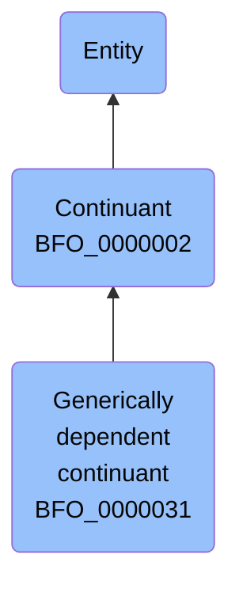

# Generically dependent continuant

## Overview

### Definition
(Elucidation) A generically dependent continuant is an entity that exists in virtue of the fact that there is at least one of what may be multiple copies which is the content or the pattern that multiple copies would share

### Examples
- The pdf file on your laptop; the pdf file that is a copy thereof on my laptop; the sequence of this protein molecule; the sequence that is a copy thereof in that protein molecule; the content that is shared by a string of dots and dashes written on a page and the transmitted Morse code signal; the content of a sentence; an engineering blueprint

### Aliases
- g-dependent continuant

### URI
http://purl.obolibrary.org/obo/BFO_0000031

### Subclass Of
- http://purl.obolibrary.org/obo/BFO_0000002

### Ontology Reference
Not defined.

### Hierarchy

## Properties
### Data Properties
| Predicate | Domain | Range | Label | Definition | Example |
|-----------|---------|--------|---------|------------|----------|

### Object Properties
| Predicate | Domain | Range | Label | Definition | Example | Inverse Of |
|-----------|---------|--------|---------|------------|----------|------------|
| http://purl.obolibrary.org/obo/BFO_0000058 | ['http://purl.obolibrary.org/obo/BFO_0000031'] | [{'or': {'or': ['http://purl.obolibrary.org/obo/BFO_0000015']}}] | is concretized by | c is concretized by b =Def b concretizes c |  | ['http://purl.obolibrary.org/obo/BFO_0000059'] |
| http://purl.obolibrary.org/obo/BFO_0000084 | ['http://purl.obolibrary.org/obo/BFO_0000031'] | [{'and': {'and': ['http://purl.obolibrary.org/obo/BFO_0000004']}}] | generically depends on | b generically depends on c =Def b is a generically dependent continuant & c is an independent continuant that is not a spatial region & at some time t there inheres in c a specifically dependent continuant which concretizes b at t |  | ['http://purl.obolibrary.org/obo/BFO_0000101'] |
| http://purl.obolibrary.org/obo/BFO_0000108 | ['http://purl.obolibrary.org/obo/BFO_0000001'] | ['http://purl.obolibrary.org/obo/BFO_0000008'] | exists at | (Elucidation) exists at is a relation between a particular and some temporal region at which the particular exists | First World War exists at 1914-1916; Mexico exists at January 1, 2000 | None |
| http://purl.obolibrary.org/obo/BFO_0000176 | ['http://purl.obolibrary.org/obo/BFO_0000002'] | ['http://purl.obolibrary.org/obo/BFO_0000002'] | continuant part of | b continuant part of c =Def b and c are continuants & there is some time t such that b and c exist at t & b continuant part of c at t | Milk teeth continuant part of human; surgically removed tumour continuant part of organism | ['http://purl.obolibrary.org/obo/BFO_0000178'] |
| http://purl.obolibrary.org/obo/BFO_0000178 | ['http://purl.obolibrary.org/obo/BFO_0000002'] | ['http://purl.obolibrary.org/obo/BFO_0000002'] | has continuant part | b has continuant part c =Def c continuant part of b |  | None |
| https://www.commoncoreontologies.org/ont00001816 | ['http://purl.obolibrary.org/obo/BFO_0000002'] | ['http://purl.obolibrary.org/obo/BFO_0000015'] | is output of | x is_output_of y iff x is an instance of Continuant and y is an instance of Process, such that the presence of x at the end of y is a necessary condition for the completion of y. |  | ['https://www.commoncoreontologies.org/ont00001986'] |
| https://www.commoncoreontologies.org/ont00001841 | ['http://purl.obolibrary.org/obo/BFO_0000002'] | ['http://purl.obolibrary.org/obo/BFO_0000015'] | is input of | x is_input_of y iff x is an instance of Continuant and y is an instance of Process, such that the presence of x at the beginning of y is a necessary condition for the start of y. |  | ['https://www.commoncoreontologies.org/ont00001921'] |
| https://www.commoncoreontologies.org/ont00001886 | ['http://purl.obolibrary.org/obo/BFO_0000002'] | ['http://purl.obolibrary.org/obo/BFO_0000015'] | is affected by | x is_affected_by y iff x is an instance of Continuant and y is an instance of Process, and y influences x in some manner, most often by producing a change in x. |  | None |
