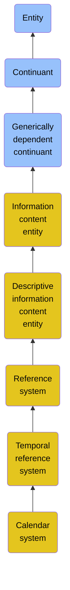

# Calendar system

## Overview

### Definition
A Temporal Reference System that is designed to organize and identify dates.

### Examples
Not defined.

### Aliases
Not defined.

### URI
https://www.commoncoreontologies.org/ont00000891

### Subclass Of

- [Entity](/docs/ontology/reference/model/Entity/Entity.md)
- [Continuant](/docs/ontology/reference/model/Entity/Continuant/Continuant.md)
- [Generically dependent continuant](/docs/ontology/reference/model/Entity/Continuant/Generically%20dependent%20continuant/Generically%20dependent%20continuant.md)
- [Information content entity](/docs/ontology/reference/model/Entity/Continuant/Generically%20dependent%20continuant/Information%20content%20entity/Information%20content%20entity.md)
- [Descriptive information content entity](/docs/ontology/reference/model/Entity/Continuant/Generically%20dependent%20continuant/Information%20content%20entity/Descriptive%20information%20content%20entity/Descriptive%20information%20content%20entity.md)
- [Reference system](/docs/ontology/reference/model/Entity/Continuant/Generically%20dependent%20continuant/Information%20content%20entity/Descriptive%20information%20content%20entity/Reference%20system/Reference%20system.md)
- [Temporal reference system](/docs/ontology/reference/model/Entity/Continuant/Generically%20dependent%20continuant/Information%20content%20entity/Descriptive%20information%20content%20entity/Reference%20system/Temporal%20reference%20system/Temporal%20reference%20system.md)
- [Calendar system](/docs/ontology/reference/model/Entity/Continuant/Generically%20dependent%20continuant/Information%20content%20entity/Descriptive%20information%20content%20entity/Reference%20system/Temporal%20reference%20system/Calendar%20system/Calendar%20system.md)

### Ontology Reference
- [cco](https://www.commoncoreontologies.org/): [InformationEntityOntology](https://www.commoncoreontologies.org/InformationEntityOntology)

## Properties
### Object Properties
| Ontology | Label | Definition | Example | Domain | Range | Inverse Of |
|----------|-------|------------|---------|--------|-------|------------|
| bfo | [exists at](http://purl.obolibrary.org/obo/BFO_0000108) | (Elucidation) exists at is a relation between a particular and some temporal region at which the particular exists | First World War exists at 1914-1916; Mexico exists at January 1, 2000 | [entity](/docs/ontology/reference/model/Entity/Entity.md) | [temporal region](/docs/ontology/reference/model/Entity/Occurrent/Temporal%20region/Temporal%20region.md) |  |
| bfo | [continuant part of](http://purl.obolibrary.org/obo/BFO_0000176) | b continuant part of c =Def b and c are continuants & there is some time t such that b and c exist at t & b continuant part of c at t | Milk teeth continuant part of human; surgically removed tumour continuant part of organism | [continuant](/docs/ontology/reference/model/Entity/Continuant/Continuant.md) | [continuant](/docs/ontology/reference/model/Entity/Continuant/Continuant.md) | [has continuant part](http://purl.obolibrary.org/obo/BFO_0000178) |
| bfo | [has continuant part](http://purl.obolibrary.org/obo/BFO_0000178) | b has continuant part c =Def c continuant part of b |  | [continuant](/docs/ontology/reference/model/Entity/Continuant/Continuant.md) | [continuant](/docs/ontology/reference/model/Entity/Continuant/Continuant.md) |  |
| cco | [is output of](https://www.commoncoreontologies.org/ont00001816) | x is_output_of y iff x is an instance of Continuant and y is an instance of Process, such that the presence of x at the end of y is a necessary condition for the completion of y. |  | [continuant](/docs/ontology/reference/model/Entity/Continuant/Continuant.md) | [process](/docs/ontology/reference/model/Entity/Occurrent/Process/Process.md) | [has output](https://www.commoncoreontologies.org/ont00001986) |
| cco | [is input of](https://www.commoncoreontologies.org/ont00001841) | x is_input_of y iff x is an instance of Continuant and y is an instance of Process, such that the presence of x at the beginning of y is a necessary condition for the start of y. |  | [continuant](/docs/ontology/reference/model/Entity/Continuant/Continuant.md) | [process](/docs/ontology/reference/model/Entity/Occurrent/Process/Process.md) | [has input](https://www.commoncoreontologies.org/ont00001921) |
| cco | [is affected by](https://www.commoncoreontologies.org/ont00001886) | x is_affected_by y iff x is an instance of Continuant and y is an instance of Process, and y influences x in some manner, most often by producing a change in x. |  | [continuant](/docs/ontology/reference/model/Entity/Continuant/Continuant.md) | [process](/docs/ontology/reference/model/Entity/Occurrent/Process/Process.md) |  |
| bfo | [is concretized by](http://purl.obolibrary.org/obo/BFO_0000058) | c is concretized by b =Def b concretizes c |  | [generically dependent continuant](/docs/ontology/reference/model/Entity/Continuant/Generically%20dependent%20continuant/Generically%20dependent%20continuant.md) |  | [concretizes](http://purl.obolibrary.org/obo/BFO_0000059) |
| bfo | [generically depends on](http://purl.obolibrary.org/obo/BFO_0000084) | b generically depends on c =Def b is a generically dependent continuant & c is an independent continuant that is not a spatial region & at some time t there inheres in c a specifically dependent continuant which concretizes b at t |  | [generically dependent continuant](/docs/ontology/reference/model/Entity/Continuant/Generically%20dependent%20continuant/Generically%20dependent%20continuant.md) |  | [is carrier of](http://purl.obolibrary.org/obo/BFO_0000101) |
| cco | [is about](https://www.commoncoreontologies.org/ont00001808) | A primitive relationship between an Information Content Entity and some Entity. |  | [Information Content Entity](/docs/ontology/reference/model/Entity/Continuant/Generically%20dependent%20continuant/Information%20content%20entity/Information%20content%20entity.md) | [entity](/docs/ontology/reference/model/Entity/Entity.md) |  |
| cco | [describes](https://www.commoncoreontologies.org/ont00001982) | x describes y iff x is an instance of Information Content Entity, and y is an instance of Entity, such that x is about the characteristics by which y can be recognized or visualized. | the content of an accident report describes some accident | [Descriptive Information Content Entity](/docs/ontology/reference/model/Entity/Continuant/Generically%20dependent%20continuant/Information%20content%20entity/Descriptive%20information%20content%20entity/Descriptive%20information%20content%20entity.md) | [None](/docs/ontology/reference/model/Entity/Occurrent/Process/None.md) |  |
| cco | [is reference system of](https://www.commoncoreontologies.org/ont00001997) | x is_reference_system_of y iff y is an instance of Information Bearing Entity and x is an instance of Reference System, such that x describes the set of standards mentioned in y. |  | [Reference System](/docs/ontology/reference/model/Entity/Continuant/Generically%20dependent%20continuant/Information%20content%20entity/Descriptive%20information%20content%20entity/Reference%20system/Reference%20system.md) | [Information Bearing Entity](/docs/ontology/reference/model/Entity/Continuant/Independent%20continuant/Material%20entity/Object/Information%20bearing%20entity/Information%20bearing%20entity.md) |  |

