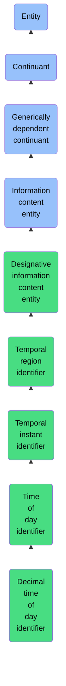

# Decimal time of day identifier

## Overview

### Definition
A Time of Day Identifier that designates an approximate Temporal Instant that is part of some Day and is specified using a decimal value for the portion of the Day that preceded the Temporal Instant.

### Examples
Not defined.

### Aliases
- Fractional Time of Day Identifier

### URI
https://www.commoncoreontologies.org/ont00000973

### Subclass Of
- Time of Day Identifier: https://www.commoncoreontologies.org/ont00000827

### Ontology Reference
- https://www.commoncoreontologies.org/InformationEntityOntology

### Hierarchy

## Properties
### Data Properties
### Object Properties
| Label | Definition | Example | Domain | Range | Inverse Of |
|-------|------------|---------|--------|-------|------------|
| [exists at](https://www.commoncoreontologies.org/ont00001916) | (Elucidation) exists at is a relation between a particular and some temporal region at which the particular exists | First World War exists at 1914-1916; Mexico exists at January 1, 2000 | [entity](http://purl.obolibrary.org/obo/BFO_0000001) | [temporal region](http://purl.obolibrary.org/obo/BFO_0000008) |  |
| [continuant part of](https://www.commoncoreontologies.org/ont00001916) | b continuant part of c =Def b and c are continuants & there is some time t such that b and c exist at t & b continuant part of c at t | Milk teeth continuant part of human; surgically removed tumour continuant part of organism | [continuant](http://purl.obolibrary.org/obo/BFO_0000002) | [continuant](http://purl.obolibrary.org/obo/BFO_0000002) | [has continuant part](http://purl.obolibrary.org/obo/BFO_0000178) |
| [has continuant part](https://www.commoncoreontologies.org/ont00001916) | b has continuant part c =Def c continuant part of b |  | [continuant](http://purl.obolibrary.org/obo/BFO_0000002) | [continuant](http://purl.obolibrary.org/obo/BFO_0000002) |  |
| [is output of](https://www.commoncoreontologies.org/ont00001916) | x is_output_of y iff x is an instance of Continuant and y is an instance of Process, such that the presence of x at the end of y is a necessary condition for the completion of y. |  | [continuant](http://purl.obolibrary.org/obo/BFO_0000002) | [process](http://purl.obolibrary.org/obo/BFO_0000015) | [has output](https://www.commoncoreontologies.org/ont00001986) |
| [is input of](https://www.commoncoreontologies.org/ont00001916) | x is_input_of y iff x is an instance of Continuant and y is an instance of Process, such that the presence of x at the beginning of y is a necessary condition for the start of y. |  | [continuant](http://purl.obolibrary.org/obo/BFO_0000002) | [process](http://purl.obolibrary.org/obo/BFO_0000015) | [has input](https://www.commoncoreontologies.org/ont00001921) |
| [is affected by](https://www.commoncoreontologies.org/ont00001916) | x is_affected_by y iff x is an instance of Continuant and y is an instance of Process, and y influences x in some manner, most often by producing a change in x. |  | [continuant](http://purl.obolibrary.org/obo/BFO_0000002) | [process](http://purl.obolibrary.org/obo/BFO_0000015) |  |
| [is concretized by](https://www.commoncoreontologies.org/ont00001916) | c is concretized by b =Def b concretizes c |  | [generically dependent continuant](http://purl.obolibrary.org/obo/BFO_0000031) | {'or': {'or': ['http://purl.obolibrary.org/obo/BFO_0000015']}} | [concretizes](http://purl.obolibrary.org/obo/BFO_0000059) |
| [generically depends on](https://www.commoncoreontologies.org/ont00001916) | b generically depends on c =Def b is a generically dependent continuant & c is an independent continuant that is not a spatial region & at some time t there inheres in c a specifically dependent continuant which concretizes b at t |  | [generically dependent continuant](http://purl.obolibrary.org/obo/BFO_0000031) | {'and': {'and': ['http://purl.obolibrary.org/obo/BFO_0000004']}} | [is carrier of](http://purl.obolibrary.org/obo/BFO_0000101) |
| [is about](https://www.commoncoreontologies.org/ont00001916) | A primitive relationship between an Information Content Entity and some Entity. |  | [Information Content Entity](https://www.commoncoreontologies.org/ont00000958) | [entity](http://purl.obolibrary.org/obo/BFO_0000001) |  |
| [designates](https://www.commoncoreontologies.org/ont00001916) | x designates y iff x is an instance of an Information Content Entity, and y is an instance of an Entity, such that given some context, x uniquely distinguishes y from other entities. | a vehicle identification number designates some vehicle | [Designative Information Content Entity](https://www.commoncoreontologies.org/ont00000686) |  |  |
