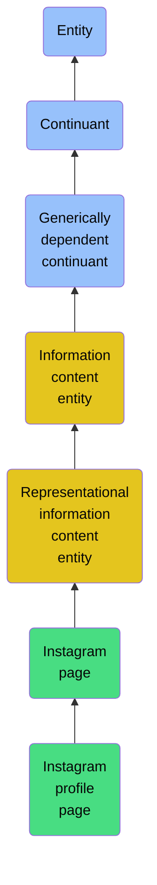

# Instagram profile page

## Overview

### Definition
An instagram profile page at a specific point in time, consisting of a unique identifier, visual representation, and metadata about the profile's content and social connections

### Examples
A snapshot of John's Instagram profile as viewed on 2023-11-10

### Aliases
Not defined.

### URI
http://ontology.naas.ai/abi/InstagramProfilePage

### Subclass Of

- [Entity](/docs/ontology/reference/model/Entity/Entity.md)
- [Continuant](/docs/ontology/reference/model/Entity/Continuant/Continuant.md)
- [Generically dependent continuant](/docs/ontology/reference/model/Entity/Continuant/Generically%20dependent%20continuant/Generically%20dependent%20continuant.md)
- [Information content entity](/docs/ontology/reference/model/Entity/Continuant/Generically%20dependent%20continuant/Information%20content%20entity/Information%20content%20entity.md)
- [Representational information content entity](/docs/ontology/reference/model/Entity/Continuant/Generically%20dependent%20continuant/Information%20content%20entity/Representational%20information%20content%20entity/Representational%20information%20content%20entity.md)
- [Instagram page](/docs/ontology/reference/model/Entity/Continuant/Generically%20dependent%20continuant/Information%20content%20entity/Representational%20information%20content%20entity/Instagram%20page/Instagram%20page.md)
- [Instagram profile page](/docs/ontology/reference/model/Entity/Continuant/Generically%20dependent%20continuant/Information%20content%20entity/Representational%20information%20content%20entity/Instagram%20page/Instagram%20profile%20page/Instagram%20profile%20page.md)

### Ontology Reference
- [abi](http://ontology.naas.ai/abi/)

## Properties
### Data Properties
| Ontology | Label | Definition | Example | Domain | Range |
|----------|-------|------------|---------|--------|-------|
| abi | [is curated in foundry](http://ontology.naas.ai/abi/is_curated_in_foundry) | Relates a class to the foundry it is curated in. | The class cco:ont00001262 is curated in the foundry 'entreprise_management_foundry' and 'personal_ai_foundry'. | [entity](/docs/ontology/reference/model/Entity/Entity.md) | [string](http://www.w3.org/2001/XMLSchema#string) |
| abi | [biography](http://ontology.naas.ai/abi/biography) | A string that is a text description of the Instagram profile owner and is part of the profile's essential identity | Don't be dead serious about your life, it's just a play. | [Instagram Profile Page](/docs/ontology/reference/model/Entity/Continuant/Generically%20dependent%20continuant/Information%20content%20entity/Representational%20information%20content%20entity/Instagram%20page/Instagram%20profile%20page/Instagram%20profile%20page.md) | [string](http://www.w3.org/2001/XMLSchema#string) |
| abi | [display name](http://ontology.naas.ai/abi/display_name) | A string that is the public name shown on the Instagram profile and is part of the profile's essential identity | Jeremy Lvr | [Instagram Profile Page](/docs/ontology/reference/model/Entity/Continuant/Generically%20dependent%20continuant/Information%20content%20entity/Representational%20information%20content%20entity/Instagram%20page/Instagram%20profile%20page/Instagram%20profile%20page.md) | [string](http://www.w3.org/2001/XMLSchema#string) |
| abi | [follower count](http://ontology.naas.ai/abi/follower_count) | An integer that is the number of accounts following this Instagram profile and is part of the profile's essential identity | 204 | [Instagram Profile Page](/docs/ontology/reference/model/Entity/Continuant/Generically%20dependent%20continuant/Information%20content%20entity/Representational%20information%20content%20entity/Instagram%20page/Instagram%20profile%20page/Instagram%20profile%20page.md) | [integer](http://www.w3.org/2001/XMLSchema#integer) |
| abi | [following count](http://ontology.naas.ai/abi/following_count) | An integer that is the number of accounts this Instagram profile follows and is part of the profile's essential identity | 410 | [Instagram Profile Page](/docs/ontology/reference/model/Entity/Continuant/Generically%20dependent%20continuant/Information%20content%20entity/Representational%20information%20content%20entity/Instagram%20page/Instagram%20profile%20page/Instagram%20profile%20page.md) | [integer](http://www.w3.org/2001/XMLSchema#integer) |
| abi | [is private](http://ontology.naas.ai/abi/is_private) | A boolean that indicates whether the Instagram account is private and is part of the profile's essential identity | false | [Instagram Profile Page](/docs/ontology/reference/model/Entity/Continuant/Generically%20dependent%20continuant/Information%20content%20entity/Representational%20information%20content%20entity/Instagram%20page/Instagram%20profile%20page/Instagram%20profile%20page.md) | [boolean](http://www.w3.org/2001/XMLSchema#boolean) |
| abi | [is verified](http://ontology.naas.ai/abi/is_verified) | A boolean that indicates whether the Instagram account has been verified by Instagram as authentic and is part of the profile's essential identity | false | [Instagram Profile Page](/docs/ontology/reference/model/Entity/Continuant/Generically%20dependent%20continuant/Information%20content%20entity/Representational%20information%20content%20entity/Instagram%20page/Instagram%20profile%20page/Instagram%20profile%20page.md) | [boolean](http://www.w3.org/2001/XMLSchema#boolean) |
| abi | [platform name](http://ontology.naas.ai/abi/platform_name) | A string that is the name of the social media platform where the profile exists and is part of the profile's essential identity | Instagram | [Instagram Profile Page](/docs/ontology/reference/model/Entity/Continuant/Generically%20dependent%20continuant/Information%20content%20entity/Representational%20information%20content%20entity/Instagram%20page/Instagram%20profile%20page/Instagram%20profile%20page.md) | [string](http://www.w3.org/2001/XMLSchema#string) |
| abi | [post count](http://ontology.naas.ai/abi/post_count) | An integer that is the number of posts published by the Instagram profile and is part of the profile's essential identity | 46 | [Instagram Profile Page](/docs/ontology/reference/model/Entity/Continuant/Generically%20dependent%20continuant/Information%20content%20entity/Representational%20information%20content%20entity/Instagram%20page/Instagram%20profile%20page/Instagram%20profile%20page.md) | [integer](http://www.w3.org/2001/XMLSchema#integer) |
| abi | [profile id](http://ontology.naas.ai/abi/profile_id) | A string that is the unique identifier for an Instagram profile and is part of the profile's essential identity | jeremy_lvr | [Instagram Profile Page](/docs/ontology/reference/model/Entity/Continuant/Generically%20dependent%20continuant/Information%20content%20entity/Representational%20information%20content%20entity/Instagram%20page/Instagram%20profile%20page/Instagram%20profile%20page.md) | [string](http://www.w3.org/2001/XMLSchema#string) |
| abi | [profile picture URL](http://ontology.naas.ai/abi/profile_picture_url) | A URI that is the URL of the profile picture image and is part of the profile's essential identity | https://www.instagram.com/jeremy_lvr/profile_pic/ | [Instagram Profile Page](/docs/ontology/reference/model/Entity/Continuant/Generically%20dependent%20continuant/Information%20content%20entity/Representational%20information%20content%20entity/Instagram%20page/Instagram%20profile%20page/Instagram%20profile%20page.md) | [anyURI](http://www.w3.org/2001/XMLSchema#anyURI) |

### Object Properties
| Ontology | Label | Definition | Example | Domain | Range | Inverse Of |
|----------|-------|------------|---------|--------|-------|------------|
| bfo | [exists at](http://purl.obolibrary.org/obo/BFO_0000108) | (Elucidation) exists at is a relation between a particular and some temporal region at which the particular exists | First World War exists at 1914-1916; Mexico exists at January 1, 2000 | [entity](/docs/ontology/reference/model/Entity/Entity.md) | [temporal region](/docs/ontology/reference/model/Entity/Occurrent/Temporal%20region/Temporal%20region.md) |  |
| bfo | [continuant part of](http://purl.obolibrary.org/obo/BFO_0000176) | b continuant part of c =Def b and c are continuants & there is some time t such that b and c exist at t & b continuant part of c at t | Milk teeth continuant part of human; surgically removed tumour continuant part of organism | [continuant](/docs/ontology/reference/model/Entity/Continuant/Continuant.md) | [continuant](/docs/ontology/reference/model/Entity/Continuant/Continuant.md) | [has continuant part](http://purl.obolibrary.org/obo/BFO_0000178) |
| bfo | [has continuant part](http://purl.obolibrary.org/obo/BFO_0000178) | b has continuant part c =Def c continuant part of b |  | [continuant](/docs/ontology/reference/model/Entity/Continuant/Continuant.md) | [continuant](/docs/ontology/reference/model/Entity/Continuant/Continuant.md) |  |
| cco | [is output of](https://www.commoncoreontologies.org/ont00001816) | x is_output_of y iff x is an instance of Continuant and y is an instance of Process, such that the presence of x at the end of y is a necessary condition for the completion of y. |  | [continuant](/docs/ontology/reference/model/Entity/Continuant/Continuant.md) | [process](/docs/ontology/reference/model/Entity/Occurrent/Process/Process.md) | [has output](https://www.commoncoreontologies.org/ont00001986) |
| cco | [is input of](https://www.commoncoreontologies.org/ont00001841) | x is_input_of y iff x is an instance of Continuant and y is an instance of Process, such that the presence of x at the beginning of y is a necessary condition for the start of y. |  | [continuant](/docs/ontology/reference/model/Entity/Continuant/Continuant.md) | [process](/docs/ontology/reference/model/Entity/Occurrent/Process/Process.md) | [has input](https://www.commoncoreontologies.org/ont00001921) |
| cco | [is affected by](https://www.commoncoreontologies.org/ont00001886) | x is_affected_by y iff x is an instance of Continuant and y is an instance of Process, and y influences x in some manner, most often by producing a change in x. |  | [continuant](/docs/ontology/reference/model/Entity/Continuant/Continuant.md) | [process](/docs/ontology/reference/model/Entity/Occurrent/Process/Process.md) |  |
| bfo | [is concretized by](http://purl.obolibrary.org/obo/BFO_0000058) | c is concretized by b =Def b concretizes c |  | [generically dependent continuant](/docs/ontology/reference/model/Entity/Continuant/Generically%20dependent%20continuant/Generically%20dependent%20continuant.md) | [{'or': ['http://purl.obolibrary.org/obo/BFO_0000015', 'http://purl.obolibrary.org/obo/BFO_0000020']}](/docs/ontology/reference/model/%7B%27or%27%3A%20%5B%27http%3A//purl.obolibrary.org/obo/BFO_0000015%27%2C%20%27http%3A//purl.obolibrary.org/obo/BFO_0000020%27%5D%7D/%7B%27or%27%3A%20%5B%27http%3A//purl.obolibrary.org/obo/bfo_0000015%27%2C%20%27http%3A//purl.obolibrary.org/obo/bfo_0000020%27%5D%7D.md) | [concretizes](http://purl.obolibrary.org/obo/BFO_0000059) |
| bfo | [generically depends on](http://purl.obolibrary.org/obo/BFO_0000084) | b generically depends on c =Def b is a generically dependent continuant & c is an independent continuant that is not a spatial region & at some time t there inheres in c a specifically dependent continuant which concretizes b at t |  | [generically dependent continuant](/docs/ontology/reference/model/Entity/Continuant/Generically%20dependent%20continuant/Generically%20dependent%20continuant.md) | [{'and': ['http://purl.obolibrary.org/obo/BFO_0000004', {'not': ['http://purl.obolibrary.org/obo/BFO_0000006']}]}](/docs/ontology/reference/model/%7B%27and%27%3A%20%5B%27http%3A//purl.obolibrary.org/obo/BFO_0000004%27%2C%20%7B%27not%27%3A%20%5B%27http%3A//purl.obolibrary.org/obo/BFO_0000006%27%5D%7D%5D%7D/%7B%27and%27%3A%20%5B%27http%3A//purl.obolibrary.org/obo/bfo_0000004%27%2C%20%7B%27not%27%3A%20%5B%27http%3A//purl.obolibrary.org/obo/bfo_0000006%27%5D%7D%5D%7D.md) | [is carrier of](http://purl.obolibrary.org/obo/BFO_0000101) |
| cco | [is about](https://www.commoncoreontologies.org/ont00001808) | A primitive relationship between an Information Content Entity and some Entity. |  | [Information Content Entity](/docs/ontology/reference/model/Entity/Continuant/Generically%20dependent%20continuant/Information%20content%20entity/Information%20content%20entity.md) | [entity](/docs/ontology/reference/model/Entity/Entity.md) |  |
| cco | [represents](https://www.commoncoreontologies.org/ont00001938) | x represents y iff x is an instance of Information Content Entity, y is an instance of Entity, and z is carrier of x, such that x is about y in virtue of there existing an isomorphism between characteristics of z and y. |  | [Representational Information Content Entity](/docs/ontology/reference/model/Entity/Continuant/Generically%20dependent%20continuant/Information%20content%20entity/Representational%20information%20content%20entity/Representational%20information%20content%20entity.md) | [None](/docs/ontology/reference/model/Entity/Occurrent/Process/None.md) |  |
| abi | [has followers](http://ontology.naas.ai/abi/hasFollowers) | An instagram profile page has followers | John's Instagram profile page has followers | [Instagram Profile Page](/docs/ontology/reference/model/Entity/Continuant/Generically%20dependent%20continuant/Information%20content%20entity/Representational%20information%20content%20entity/Instagram%20page/Instagram%20profile%20page/Instagram%20profile%20page.md) | [Instagram Profile Page](/docs/ontology/reference/model/Entity/Continuant/Generically%20dependent%20continuant/Information%20content%20entity/Representational%20information%20content%20entity/Instagram%20page/Instagram%20profile%20page/Instagram%20profile%20page.md) |  |
| abi | [has instagram post](http://ontology.naas.ai/abi/hasInstagramPost) | An instagram profile page has an instagram post | John's Instagram profile page has a post about his new book | [Instagram Profile Page](/docs/ontology/reference/model/Entity/Continuant/Generically%20dependent%20continuant/Information%20content%20entity/Representational%20information%20content%20entity/Instagram%20page/Instagram%20profile%20page/Instagram%20profile%20page.md) | [Instagram Post Page](/docs/ontology/reference/model/Entity/Continuant/Generically%20dependent%20continuant/Information%20content%20entity/Representational%20information%20content%20entity/Instagram%20page/Instagram%20post%20page/Instagram%20post%20page.md) |  |
| abi | [is following](http://ontology.naas.ai/abi/isFollowing) | An instagram profile page is following another instagram profile page | John's Instagram profile page is following Jane's Instagram profile page | [Instagram Profile Page](/docs/ontology/reference/model/Entity/Continuant/Generically%20dependent%20continuant/Information%20content%20entity/Representational%20information%20content%20entity/Instagram%20page/Instagram%20profile%20page/Instagram%20profile%20page.md) | [Instagram Profile Page](/docs/ontology/reference/model/Entity/Continuant/Generically%20dependent%20continuant/Information%20content%20entity/Representational%20information%20content%20entity/Instagram%20page/Instagram%20profile%20page/Instagram%20profile%20page.md) |  |

