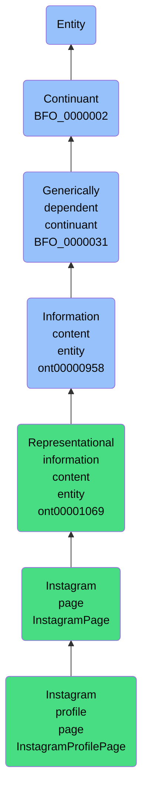

# Instagram profile page

## Overview

### Definition
An instagram profile page at a specific point in time, consisting of a unique identifier, visual representation, and metadata about the profile's content and social connections

### Examples
- A snapshot of John's Instagram profile as viewed on 2023-11-10

### Aliases
Not defined.

### URI
http://ontology.naas.ai/abi/InstagramProfilePage

### Subclass Of
- http://ontology.naas.ai/abi/InstagramPage

### Ontology Reference
Not defined.

### Hierarchy

## Properties
### Data Properties
| Predicate | Domain | Range | Label | Definition | Example |
|-----------|---------|--------|---------|------------|----------|
| http://ontology.naas.ai/abi/biography | ['http://ontology.naas.ai/abi/InstagramProfilePage'] | ['http://www.w3.org/2001/XMLSchema#string'] | biography | A string that is a text description of the Instagram profile owner and is part of the profile's essential identity | Don't be dead serious about your life, it's just a play. |
| http://ontology.naas.ai/abi/display_name | ['http://ontology.naas.ai/abi/InstagramProfilePage'] | ['http://www.w3.org/2001/XMLSchema#string'] | display name | A string that is the public name shown on the Instagram profile and is part of the profile's essential identity | Jeremy Lvr |
| http://ontology.naas.ai/abi/follower_count | ['http://ontology.naas.ai/abi/InstagramProfilePage'] | ['http://www.w3.org/2001/XMLSchema#integer'] | follower count | An integer that is the number of accounts following this Instagram profile and is part of the profile's essential identity | 204 |
| http://ontology.naas.ai/abi/following_count | ['http://ontology.naas.ai/abi/InstagramProfilePage'] | ['http://www.w3.org/2001/XMLSchema#integer'] | following count | An integer that is the number of accounts this Instagram profile follows and is part of the profile's essential identity | 410 |
| http://ontology.naas.ai/abi/is_private | ['http://ontology.naas.ai/abi/InstagramProfilePage'] | ['http://www.w3.org/2001/XMLSchema#boolean'] | is private | A boolean that indicates whether the Instagram account is private and is part of the profile's essential identity | false |
| http://ontology.naas.ai/abi/is_verified | ['http://ontology.naas.ai/abi/InstagramProfilePage'] | ['http://www.w3.org/2001/XMLSchema#boolean'] | is verified | A boolean that indicates whether the Instagram account has been verified by Instagram as authentic and is part of the profile's essential identity | false |
| http://ontology.naas.ai/abi/platform_name | ['http://ontology.naas.ai/abi/InstagramProfilePage'] | ['http://www.w3.org/2001/XMLSchema#string'] | platform name | A string that is the name of the social media platform where the profile exists and is part of the profile's essential identity | Instagram |
| http://ontology.naas.ai/abi/post_count | ['http://ontology.naas.ai/abi/InstagramProfilePage'] | ['http://www.w3.org/2001/XMLSchema#integer'] | post count | An integer that is the number of posts published by the Instagram profile and is part of the profile's essential identity | 46 |
| http://ontology.naas.ai/abi/profile_id | ['http://ontology.naas.ai/abi/InstagramProfilePage'] | ['http://www.w3.org/2001/XMLSchema#string'] | profile id | A string that is the unique identifier for an Instagram profile and is part of the profile's essential identity | jeremy_lvr |
| http://ontology.naas.ai/abi/profile_picture_url | ['http://ontology.naas.ai/abi/InstagramProfilePage'] | ['http://www.w3.org/2001/XMLSchema#anyURI'] | profile picture URL | A URI that is the URL of the profile picture image and is part of the profile's essential identity | https://www.instagram.com/jeremy_lvr/profile_pic/ |

### Object Properties
| Predicate | Domain | Range | Label | Definition | Example | Inverse Of |
|-----------|---------|--------|---------|------------|----------|------------|
| http://ontology.naas.ai/abi/hasFollowers | ['http://ontology.naas.ai/abi/InstagramProfilePage'] | ['http://ontology.naas.ai/abi/InstagramProfilePage'] | has followers | An instagram profile page has followers | John's Instagram profile page has followers | None |
| http://ontology.naas.ai/abi/hasInstagramPost | ['http://ontology.naas.ai/abi/InstagramProfilePage'] | ['http://ontology.naas.ai/abi/InstagramPostPage'] | has instagram post | An instagram profile page has an instagram post | John's Instagram profile page has a post about his new book | None |
| http://ontology.naas.ai/abi/isFollowing | ['http://ontology.naas.ai/abi/InstagramProfilePage'] | ['http://ontology.naas.ai/abi/InstagramProfilePage'] | is following | An instagram profile page is following another instagram profile page | John's Instagram profile page is following Jane's Instagram profile page | None |
| http://purl.obolibrary.org/obo/BFO_0000058 | ['http://purl.obolibrary.org/obo/BFO_0000031'] | [{'or': {'or': ['http://purl.obolibrary.org/obo/BFO_0000015']}}] | is concretized by | c is concretized by b =Def b concretizes c |  | ['http://purl.obolibrary.org/obo/BFO_0000059'] |
| http://purl.obolibrary.org/obo/BFO_0000084 | ['http://purl.obolibrary.org/obo/BFO_0000031'] | [{'and': {'and': ['http://purl.obolibrary.org/obo/BFO_0000004']}}] | generically depends on | b generically depends on c =Def b is a generically dependent continuant & c is an independent continuant that is not a spatial region & at some time t there inheres in c a specifically dependent continuant which concretizes b at t |  | ['http://purl.obolibrary.org/obo/BFO_0000101'] |
| http://purl.obolibrary.org/obo/BFO_0000108 | ['http://purl.obolibrary.org/obo/BFO_0000001'] | ['http://purl.obolibrary.org/obo/BFO_0000008'] | exists at | (Elucidation) exists at is a relation between a particular and some temporal region at which the particular exists | First World War exists at 1914-1916; Mexico exists at January 1, 2000 | None |
| http://purl.obolibrary.org/obo/BFO_0000176 | ['http://purl.obolibrary.org/obo/BFO_0000002'] | ['http://purl.obolibrary.org/obo/BFO_0000002'] | continuant part of | b continuant part of c =Def b and c are continuants & there is some time t such that b and c exist at t & b continuant part of c at t | Milk teeth continuant part of human; surgically removed tumour continuant part of organism | ['http://purl.obolibrary.org/obo/BFO_0000178'] |
| http://purl.obolibrary.org/obo/BFO_0000178 | ['http://purl.obolibrary.org/obo/BFO_0000002'] | ['http://purl.obolibrary.org/obo/BFO_0000002'] | has continuant part | b has continuant part c =Def c continuant part of b |  | None |
| https://www.commoncoreontologies.org/ont00001808 | ['https://www.commoncoreontologies.org/ont00000958'] | ['http://purl.obolibrary.org/obo/BFO_0000001'] | is about | A primitive relationship between an Information Content Entity and some Entity. |  | None |
| https://www.commoncoreontologies.org/ont00001816 | ['http://purl.obolibrary.org/obo/BFO_0000002'] | ['http://purl.obolibrary.org/obo/BFO_0000015'] | is output of | x is_output_of y iff x is an instance of Continuant and y is an instance of Process, such that the presence of x at the end of y is a necessary condition for the completion of y. |  | ['https://www.commoncoreontologies.org/ont00001986'] |
| https://www.commoncoreontologies.org/ont00001841 | ['http://purl.obolibrary.org/obo/BFO_0000002'] | ['http://purl.obolibrary.org/obo/BFO_0000015'] | is input of | x is_input_of y iff x is an instance of Continuant and y is an instance of Process, such that the presence of x at the beginning of y is a necessary condition for the start of y. |  | ['https://www.commoncoreontologies.org/ont00001921'] |
| https://www.commoncoreontologies.org/ont00001886 | ['http://purl.obolibrary.org/obo/BFO_0000002'] | ['http://purl.obolibrary.org/obo/BFO_0000015'] | is affected by | x is_affected_by y iff x is an instance of Continuant and y is an instance of Process, and y influences x in some manner, most often by producing a change in x. |  | None |
| https://www.commoncoreontologies.org/ont00001938 | ['https://www.commoncoreontologies.org/ont00001069'] | None | represents | x represents y iff x is an instance of Information Content Entity, y is an instance of Entity, and z is carrier of x, such that x is about y in virtue of there existing an isomorphism between characteristics of z and y. |  | None |
