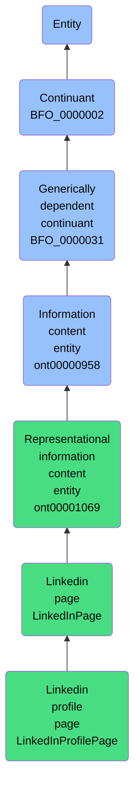

# Linkedin profile page

## Overview

### Definition
A LinkedIn profile page that includes information such as a person's professional history, skills, and endorsements, representing the individual's professional identity on the web.

### Examples
- John Doe's LinkedIn profile page, which lists his work experience at various companies, skills such as programming and data analysis, and endorsements from colleagues.

### Aliases
Not defined.

### URI
http://ontology.naas.ai/abi/LinkedInProfilePage

### Subclass Of
- http://ontology.naas.ai/abi/LinkedInPage

### Ontology Reference
Not defined.

### Hierarchy

## Properties
### Data Properties
| Predicate | Domain | Range | Label | Definition | Example |
|-----------|---------|--------|---------|------------|----------|
| http://ontology.naas.ai/abi/linkedin_id | ['http://ontology.naas.ai/abi/LinkedInPage'] | ['http://www.w3.org/2001/XMLSchema#string'] | LinkedIn ID | The ID of the LinkedIn page. | The unique ID of John Doe's LinkedIn profile page is 'ACoAAAa5py0Bzrp5_7OmHIsNP6xxxxxxxx'. |
| http://ontology.naas.ai/abi/linkedin_public_id | ['http://ontology.naas.ai/abi/LinkedInPage'] | ['http://www.w3.org/2001/XMLSchema#string'] | LinkedIn Public ID | The public ID of the LinkedIn page. It might change over time. | The public ID of John Doe's LinkedIn profile page is 'johndoe'. |
| http://ontology.naas.ai/abi/linkedin_public_url | ['http://ontology.naas.ai/abi/LinkedInPage'] | ['http://www.w3.org/2001/XMLSchema#string'] | LinkedIn Public URL | The public URL of the LinkedIn page. It uses the LinkedIn Public ID as identifier. | The public URL of John Doe's LinkedIn profile page is 'https://www.linkedin.com/in/johndoe'. |
| http://ontology.naas.ai/abi/linkedin_url | ['http://ontology.naas.ai/abi/LinkedInPage'] | ['http://www.w3.org/2001/XMLSchema#string'] | LinkedIn URL | The URL of the LinkedIn page. It uses the LinkedIn ID as a unique identifier. | The URL of John Doe's LinkedIn profile page is 'https://www.linkedin.com/in/ACoAAAa5py0Bzrp5_7OmHIsNP6xxxxxxxx'. |

### Object Properties
| Predicate | Domain | Range | Label | Definition | Example | Inverse Of |
|-----------|---------|--------|---------|------------|----------|------------|
| http://ontology.naas.ai/abi/isLinkedInPageOf | ['http://ontology.naas.ai/abi/LinkedInPage'] | [{'or': {'or': ['https://www.commoncoreontologies.org/ont00001180']}}] | is linkedin page of | Relates a LinkedIn page to the entity it represents. | A LinkedIn profile page that represents John Doe's professional presence. | ['http://ontology.naas.ai/abi/hasLinkedInPage'] |
| http://purl.obolibrary.org/obo/BFO_0000058 | ['http://purl.obolibrary.org/obo/BFO_0000031'] | [{'or': {'or': ['http://purl.obolibrary.org/obo/BFO_0000015']}}] | is concretized by | c is concretized by b =Def b concretizes c |  | ['http://purl.obolibrary.org/obo/BFO_0000059'] |
| http://purl.obolibrary.org/obo/BFO_0000084 | ['http://purl.obolibrary.org/obo/BFO_0000031'] | [{'and': {'and': ['http://purl.obolibrary.org/obo/BFO_0000004']}}] | generically depends on | b generically depends on c =Def b is a generically dependent continuant & c is an independent continuant that is not a spatial region & at some time t there inheres in c a specifically dependent continuant which concretizes b at t |  | ['http://purl.obolibrary.org/obo/BFO_0000101'] |
| http://purl.obolibrary.org/obo/BFO_0000108 | ['http://purl.obolibrary.org/obo/BFO_0000001'] | ['http://purl.obolibrary.org/obo/BFO_0000008'] | exists at | (Elucidation) exists at is a relation between a particular and some temporal region at which the particular exists | First World War exists at 1914-1916; Mexico exists at January 1, 2000 | None |
| http://purl.obolibrary.org/obo/BFO_0000176 | ['http://purl.obolibrary.org/obo/BFO_0000002'] | ['http://purl.obolibrary.org/obo/BFO_0000002'] | continuant part of | b continuant part of c =Def b and c are continuants & there is some time t such that b and c exist at t & b continuant part of c at t | Milk teeth continuant part of human; surgically removed tumour continuant part of organism | ['http://purl.obolibrary.org/obo/BFO_0000178'] |
| http://purl.obolibrary.org/obo/BFO_0000178 | ['http://purl.obolibrary.org/obo/BFO_0000002'] | ['http://purl.obolibrary.org/obo/BFO_0000002'] | has continuant part | b has continuant part c =Def c continuant part of b |  | None |
| https://www.commoncoreontologies.org/ont00001808 | ['https://www.commoncoreontologies.org/ont00000958'] | ['http://purl.obolibrary.org/obo/BFO_0000001'] | is about | A primitive relationship between an Information Content Entity and some Entity. |  | None |
| https://www.commoncoreontologies.org/ont00001816 | ['http://purl.obolibrary.org/obo/BFO_0000002'] | ['http://purl.obolibrary.org/obo/BFO_0000015'] | is output of | x is_output_of y iff x is an instance of Continuant and y is an instance of Process, such that the presence of x at the end of y is a necessary condition for the completion of y. |  | ['https://www.commoncoreontologies.org/ont00001986'] |
| https://www.commoncoreontologies.org/ont00001841 | ['http://purl.obolibrary.org/obo/BFO_0000002'] | ['http://purl.obolibrary.org/obo/BFO_0000015'] | is input of | x is_input_of y iff x is an instance of Continuant and y is an instance of Process, such that the presence of x at the beginning of y is a necessary condition for the start of y. |  | ['https://www.commoncoreontologies.org/ont00001921'] |
| https://www.commoncoreontologies.org/ont00001886 | ['http://purl.obolibrary.org/obo/BFO_0000002'] | ['http://purl.obolibrary.org/obo/BFO_0000015'] | is affected by | x is_affected_by y iff x is an instance of Continuant and y is an instance of Process, and y influences x in some manner, most often by producing a change in x. |  | None |
| https://www.commoncoreontologies.org/ont00001938 | ['https://www.commoncoreontologies.org/ont00001069'] | None | represents | x represents y iff x is an instance of Information Content Entity, y is an instance of Entity, and z is carrier of x, such that x is about y in virtue of there existing an isomorphism between characteristics of z and y. |  | None |
