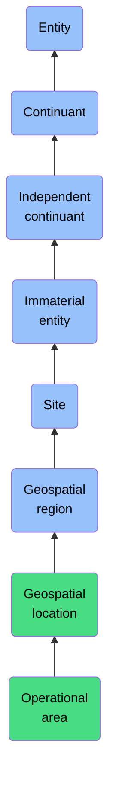

# Operational area

## Overview

### Definition
A Geospatial Location in which an Agent conducts some activity.

### Examples
Not defined.

### Aliases
Not defined.

### URI
https://www.commoncoreontologies.org/ont00000567

### Subclass Of
- Geospatial Location: https://www.commoncoreontologies.org/ont00000487

### Ontology Reference
- https://www.commoncoreontologies.org/AgentOntology

### Hierarchy

## Properties
### Data Properties
### Object Properties
| Label | Definition | Example | Domain | Range | Inverse Of |
|-------|------------|---------|--------|-------|------------|
| [exists at](https://www.commoncoreontologies.org/ont00001989) | (Elucidation) exists at is a relation between a particular and some temporal region at which the particular exists | First World War exists at 1914-1916; Mexico exists at January 1, 2000 | [entity](http://purl.obolibrary.org/obo/BFO_0000001) | [temporal region](http://purl.obolibrary.org/obo/BFO_0000008) |  |
| [continuant part of](https://www.commoncoreontologies.org/ont00001989) | b continuant part of c =Def b and c are continuants & there is some time t such that b and c exist at t & b continuant part of c at t | Milk teeth continuant part of human; surgically removed tumour continuant part of organism | [continuant](http://purl.obolibrary.org/obo/BFO_0000002) | [continuant](http://purl.obolibrary.org/obo/BFO_0000002) | [has continuant part](http://purl.obolibrary.org/obo/BFO_0000178) |
| [has continuant part](https://www.commoncoreontologies.org/ont00001989) | b has continuant part c =Def c continuant part of b |  | [continuant](http://purl.obolibrary.org/obo/BFO_0000002) | [continuant](http://purl.obolibrary.org/obo/BFO_0000002) |  |
| [is output of](https://www.commoncoreontologies.org/ont00001989) | x is_output_of y iff x is an instance of Continuant and y is an instance of Process, such that the presence of x at the end of y is a necessary condition for the completion of y. |  | [continuant](http://purl.obolibrary.org/obo/BFO_0000002) | [process](http://purl.obolibrary.org/obo/BFO_0000015) | [has output](https://www.commoncoreontologies.org/ont00001986) |
| [is input of](https://www.commoncoreontologies.org/ont00001989) | x is_input_of y iff x is an instance of Continuant and y is an instance of Process, such that the presence of x at the beginning of y is a necessary condition for the start of y. |  | [continuant](http://purl.obolibrary.org/obo/BFO_0000002) | [process](http://purl.obolibrary.org/obo/BFO_0000015) | [has input](https://www.commoncoreontologies.org/ont00001921) |
| [is affected by](https://www.commoncoreontologies.org/ont00001989) | x is_affected_by y iff x is an instance of Continuant and y is an instance of Process, and y influences x in some manner, most often by producing a change in x. |  | [continuant](http://purl.obolibrary.org/obo/BFO_0000002) | [process](http://purl.obolibrary.org/obo/BFO_0000015) |  |
| [is successor of](https://www.commoncoreontologies.org/ont00001989) | A continuant c2 is a successor of some continuant c1 iff there is some process p1 and c1 is an input to p1 and c2 is an output of p1. Inverse of is predecessor.  |  | [independent continuant](http://purl.obolibrary.org/obo/BFO_0000004) | [independent continuant](http://purl.obolibrary.org/obo/BFO_0000004) | [is predecessor of](https://www.commoncoreontologies.org/ont00001928) |
| [is predecessor of](https://www.commoncoreontologies.org/ont00001989) | A continuant c1 is a predecessor of some continuant c2 iff there is some process p1 and c1 is an input to p1 and c2 is an output of p1. |  | [independent continuant](http://purl.obolibrary.org/obo/BFO_0000004) | [independent continuant](http://purl.obolibrary.org/obo/BFO_0000004) |  |
| [coincides with](https://www.commoncoreontologies.org/ont00001989) | An immaterial entity im1 coincides with some immaterial entity im2 iff im1 is a spatial part of im2 and im2 is a spatial part of im1. |  | [immaterial entity](http://purl.obolibrary.org/obo/BFO_0000141) | [immaterial entity](http://purl.obolibrary.org/obo/BFO_0000141) |  |
| [tangential part of](https://www.commoncoreontologies.org/ont00001989) | An immaterial entity im1 is a tangential part of some immaterial entity im2 iff im1 is a spatial part of im2 and there exists some immaterial entity im3 such that im3 externally connects with im1 and im3 externally connects with im2. |  | [immaterial entity](http://purl.obolibrary.org/obo/BFO_0000141) | [immaterial entity](http://purl.obolibrary.org/obo/BFO_0000141) | [has tangential part](https://www.commoncoreontologies.org/ont00001909) |
| [partially overlaps with](https://www.commoncoreontologies.org/ont00001989) | An immaterial entity im1 partially overlaps with some immaterial entity im2 iff im1 overlaps with im2 and im1 is not a spatial part of im2 and im2 is not a spatial part of im1. |  | [immaterial entity](http://purl.obolibrary.org/obo/BFO_0000141) | [immaterial entity](http://purl.obolibrary.org/obo/BFO_0000141) |  |
| [connected with](https://www.commoncoreontologies.org/ont00001989) | An immaterial entity im1 is connected with some immaterial entity im2 iff there exists some immaterial entity im3 that is common to both im1 and im2. |  | [immaterial entity](http://purl.obolibrary.org/obo/BFO_0000141) | [immaterial entity](http://purl.obolibrary.org/obo/BFO_0000141) |  |
| [nontangential part of](https://www.commoncoreontologies.org/ont00001989) | An immaterial entity im1 is a nontangential part of some immaterial entity im2 iff im1 is a spatial part of im2 and there does not exist an immaterial entity im3 such that im3 externally connects with im1 and im3 externally connects with im2. |  | [immaterial entity](http://purl.obolibrary.org/obo/BFO_0000141) | [immaterial entity](http://purl.obolibrary.org/obo/BFO_0000141) | [has nontangential part](https://www.commoncoreontologies.org/ont00001989) |
| [disconnected with](https://www.commoncoreontologies.org/ont00001989) | An immaterial entity im1 is disconnected with some immaterial entity im2 iff there does not exist some immaterial entity im3 that is common to both im1 and im2. |  | [immaterial entity](http://purl.obolibrary.org/obo/BFO_0000141) | [immaterial entity](http://purl.obolibrary.org/obo/BFO_0000141) |  |
| [has spatial part](https://www.commoncoreontologies.org/ont00001989) | y has_spatial_part x iff x, y, z, and q are instances of Immaterial Entity, such that for any z connected with x, z is also connected with y, and q is connected with y but not connected with x. |  | [immaterial entity](http://purl.obolibrary.org/obo/BFO_0000141) | [immaterial entity](http://purl.obolibrary.org/obo/BFO_0000141) | [spatial part of](https://www.commoncoreontologies.org/ont00001944) |
| [has tangential part](https://www.commoncoreontologies.org/ont00001989) | x has_tangential_part y iff x, y, and z are instances of Immaterial Entity, and x has_spatial_part y, such that z externally connects with both x and y. |  | [immaterial entity](http://purl.obolibrary.org/obo/BFO_0000141) | [immaterial entity](http://purl.obolibrary.org/obo/BFO_0000141) |  |
| [externally connects with](https://www.commoncoreontologies.org/ont00001989) | An immaterial entity im1 externally connects with some immaterial entity im2 iff im1 connects with im2 and im1 does not overlap with im2. |  | [immaterial entity](http://purl.obolibrary.org/obo/BFO_0000141) | [immaterial entity](http://purl.obolibrary.org/obo/BFO_0000141) |  |
| [spatial part of](https://www.commoncoreontologies.org/ont00001989) | x spatial_part_of y iff x, y, z, and q are instances of Immaterial Entity, such that for any z connected with x, z is also connected with y, and q is connected with y but not connected with x. |  | [immaterial entity](http://purl.obolibrary.org/obo/BFO_0000141) | [immaterial entity](http://purl.obolibrary.org/obo/BFO_0000141) |  |
| [has nontangential part](https://www.commoncoreontologies.org/ont00001989) | x has_nontangential_part y iff x and y are instances of Immaterial Entity, and x has_spatial_part y, such that there does not exist another instance of an Immaterial Entity which externally connects with both x and y. |  | [immaterial entity](http://purl.obolibrary.org/obo/BFO_0000141) | [immaterial entity](http://purl.obolibrary.org/obo/BFO_0000141) |  |
| [is site of](https://www.commoncoreontologies.org/ont00001989) | x is_site_of y iff x is an instance of Site and y is an instance of Process, such that y occurs in x. |  | [site](http://purl.obolibrary.org/obo/BFO_0000029) | [process](http://purl.obolibrary.org/obo/BFO_0000015) | [occurs at](https://www.commoncoreontologies.org/ont00001918) |
