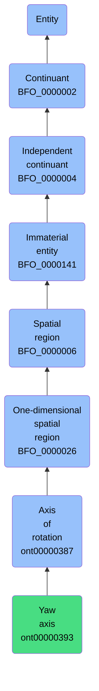

# Yaw axis

## Overview

### Definition
An Axis of Rotation that passes through the center of an object's Mass from the top to the bottom and is perpendicular to the direction of the object's motion. For objects in Orbit, the Yaw Axis passes through the Barycenter of its Orbit.

### Examples
Not defined.

### Aliases
- Vertical Axis

### URI
https://www.commoncoreontologies.org/ont00000393

### Subclass Of
- https://www.commoncoreontologies.org/ont00000387

### Ontology Reference
- https://www.commoncoreontologies.org/GeospatialOntology

### Hierarchy

## Properties
### Data Properties
| Predicate | Domain | Range | Label | Definition | Example |
|-----------|---------|--------|---------|------------|----------|

### Object Properties
| Predicate | Domain | Range | Label | Definition | Example | Inverse Of |
|-----------|---------|--------|---------|------------|----------|------------|
| http://purl.obolibrary.org/obo/BFO_0000108 | ['http://purl.obolibrary.org/obo/BFO_0000001'] | ['http://purl.obolibrary.org/obo/BFO_0000008'] | exists at | (Elucidation) exists at is a relation between a particular and some temporal region at which the particular exists | First World War exists at 1914-1916; Mexico exists at January 1, 2000 | None |
| http://purl.obolibrary.org/obo/BFO_0000176 | ['http://purl.obolibrary.org/obo/BFO_0000002'] | ['http://purl.obolibrary.org/obo/BFO_0000002'] | continuant part of | b continuant part of c =Def b and c are continuants & there is some time t such that b and c exist at t & b continuant part of c at t | Milk teeth continuant part of human; surgically removed tumour continuant part of organism | ['http://purl.obolibrary.org/obo/BFO_0000178'] |
| http://purl.obolibrary.org/obo/BFO_0000178 | ['http://purl.obolibrary.org/obo/BFO_0000002'] | ['http://purl.obolibrary.org/obo/BFO_0000002'] | has continuant part | b has continuant part c =Def c continuant part of b |  | None |
| https://www.commoncoreontologies.org/ont00001775 | ['http://purl.obolibrary.org/obo/BFO_0000004'] | ['http://purl.obolibrary.org/obo/BFO_0000004'] | is successor of | A continuant c2 is a successor of some continuant c1 iff there is some process p1 and c1 is an input to p1 and c2 is an output of p1. Inverse of is predecessor.  |  | ['https://www.commoncoreontologies.org/ont00001928'] |
| https://www.commoncoreontologies.org/ont00001791 | ['http://purl.obolibrary.org/obo/BFO_0000141'] | ['http://purl.obolibrary.org/obo/BFO_0000141'] | coincides with | An immaterial entity im1 coincides with some immaterial entity im2 iff im1 is a spatial part of im2 and im2 is a spatial part of im1. |  | None |
| https://www.commoncoreontologies.org/ont00001796 | ['http://purl.obolibrary.org/obo/BFO_0000141'] | ['http://purl.obolibrary.org/obo/BFO_0000141'] | tangential part of | An immaterial entity im1 is a tangential part of some immaterial entity im2 iff im1 is a spatial part of im2 and there exists some immaterial entity im3 such that im3 externally connects with im1 and im3 externally connects with im2. |  | ['https://www.commoncoreontologies.org/ont00001909'] |
| https://www.commoncoreontologies.org/ont00001797 | ['http://purl.obolibrary.org/obo/BFO_0000141'] | ['http://purl.obolibrary.org/obo/BFO_0000141'] | partially overlaps with | An immaterial entity im1 partially overlaps with some immaterial entity im2 iff im1 overlaps with im2 and im1 is not a spatial part of im2 and im2 is not a spatial part of im1. |  | None |
| https://www.commoncoreontologies.org/ont00001810 | ['http://purl.obolibrary.org/obo/BFO_0000141'] | ['http://purl.obolibrary.org/obo/BFO_0000141'] | connected with | An immaterial entity im1 is connected with some immaterial entity im2 iff there exists some immaterial entity im3 that is common to both im1 and im2. |  | None |
| https://www.commoncoreontologies.org/ont00001816 | ['http://purl.obolibrary.org/obo/BFO_0000002'] | ['http://purl.obolibrary.org/obo/BFO_0000015'] | is output of | x is_output_of y iff x is an instance of Continuant and y is an instance of Process, such that the presence of x at the end of y is a necessary condition for the completion of y. |  | ['https://www.commoncoreontologies.org/ont00001986'] |
| https://www.commoncoreontologies.org/ont00001827 | ['http://purl.obolibrary.org/obo/BFO_0000141'] | ['http://purl.obolibrary.org/obo/BFO_0000141'] | nontangential part of | An immaterial entity im1 is a nontangential part of some immaterial entity im2 iff im1 is a spatial part of im2 and there does not exist an immaterial entity im3 such that im3 externally connects with im1 and im3 externally connects with im2. |  | ['https://www.commoncoreontologies.org/ont00001989'] |
| https://www.commoncoreontologies.org/ont00001838 | ['http://purl.obolibrary.org/obo/BFO_0000141'] | ['http://purl.obolibrary.org/obo/BFO_0000141'] | disconnected with | An immaterial entity im1 is disconnected with some immaterial entity im2 iff there does not exist some immaterial entity im3 that is common to both im1 and im2. |  | None |
| https://www.commoncoreontologies.org/ont00001841 | ['http://purl.obolibrary.org/obo/BFO_0000002'] | ['http://purl.obolibrary.org/obo/BFO_0000015'] | is input of | x is_input_of y iff x is an instance of Continuant and y is an instance of Process, such that the presence of x at the beginning of y is a necessary condition for the start of y. |  | ['https://www.commoncoreontologies.org/ont00001921'] |
| https://www.commoncoreontologies.org/ont00001855 | ['http://purl.obolibrary.org/obo/BFO_0000141'] | ['http://purl.obolibrary.org/obo/BFO_0000141'] | has spatial part | y has_spatial_part x iff x, y, z, and q are instances of Immaterial Entity, such that for any z connected with x, z is also connected with y, and q is connected with y but not connected with x. |  | ['https://www.commoncoreontologies.org/ont00001944'] |
| https://www.commoncoreontologies.org/ont00001886 | ['http://purl.obolibrary.org/obo/BFO_0000002'] | ['http://purl.obolibrary.org/obo/BFO_0000015'] | is affected by | x is_affected_by y iff x is an instance of Continuant and y is an instance of Process, and y influences x in some manner, most often by producing a change in x. |  | None |
| https://www.commoncoreontologies.org/ont00001909 | ['http://purl.obolibrary.org/obo/BFO_0000141'] | ['http://purl.obolibrary.org/obo/BFO_0000141'] | has tangential part | x has_tangential_part y iff x, y, and z are instances of Immaterial Entity, and x has_spatial_part y, such that z externally connects with both x and y. |  | None |
| https://www.commoncoreontologies.org/ont00001928 | ['http://purl.obolibrary.org/obo/BFO_0000004'] | ['http://purl.obolibrary.org/obo/BFO_0000004'] | is predecessor of | A continuant c1 is a predecessor of some continuant c2 iff there is some process p1 and c1 is an input to p1 and c2 is an output of p1. |  | None |
| https://www.commoncoreontologies.org/ont00001931 | ['http://purl.obolibrary.org/obo/BFO_0000141'] | ['http://purl.obolibrary.org/obo/BFO_0000141'] | externally connects with | An immaterial entity im1 externally connects with some immaterial entity im2 iff im1 connects with im2 and im1 does not overlap with im2. |  | None |
| https://www.commoncoreontologies.org/ont00001944 | ['http://purl.obolibrary.org/obo/BFO_0000141'] | ['http://purl.obolibrary.org/obo/BFO_0000141'] | spatial part of | x spatial_part_of y iff x, y, z, and q are instances of Immaterial Entity, such that for any z connected with x, z is also connected with y, and q is connected with y but not connected with x. |  | None |
| https://www.commoncoreontologies.org/ont00001989 | ['http://purl.obolibrary.org/obo/BFO_0000141'] | ['http://purl.obolibrary.org/obo/BFO_0000141'] | has nontangential part | x has_nontangential_part y iff x and y are instances of Immaterial Entity, and x has_spatial_part y, such that there does not exist another instance of an Immaterial Entity which externally connects with both x and y. |  | None |
